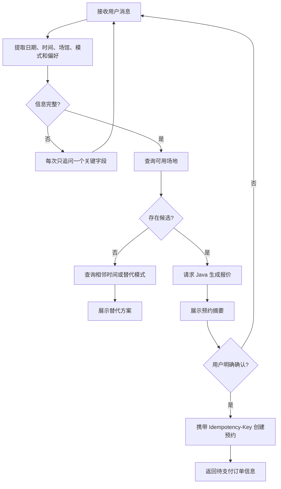
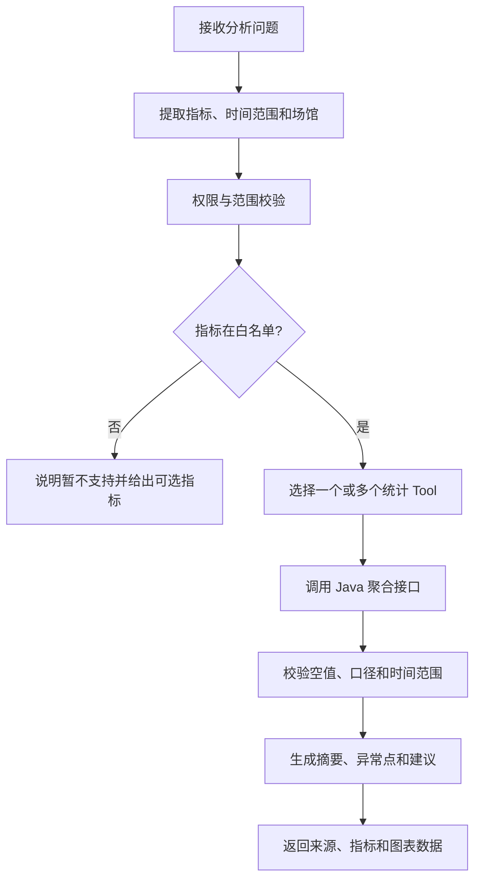
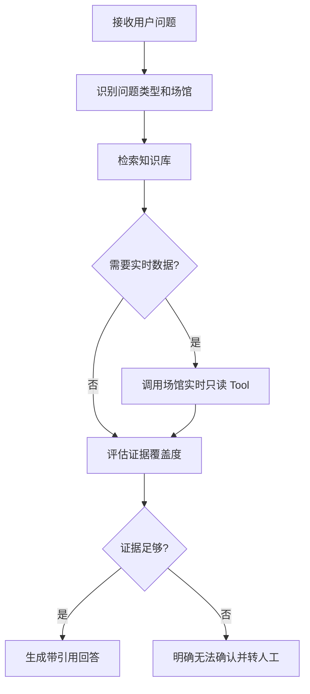

# BMP三智能体开发计划

> 文档状态：已确认，待实施
> 制定日期：2026-07-16
> 适用项目：羽擎（Badminton Management Platform，BMP）
> 建设目标：先建立专业 AI Agent 工程能力，再逐步达到可用于真实业务的生产标准。

## 1. 背景与目标

BMP 已具备 Spring Boot 3.2、Vue 3、UniApp、MySQL、Redis、JWT、RBAC、WebSocket，以及场馆、场地、预约、财务、会员等完整业务能力。本计划不重写这些确定性业务，而是在现有系统旁新增独立的 Python Agent 服务，将大模型的自然语言理解、任务编排、知识检索和分析能力接入现有 Java Service。

本计划交付三只 Agent：

1. 智能预订 Agent：理解用户需求、查询空场、推荐候选方案，并在用户确认后创建预约。
2. 经营分析 Agent：读取权限范围内的经营指标，生成可追溯的分析结论和调价建议。
3. 场馆客服 Agent：基于场馆规则、价格、退款政策和 FAQ 提供带来源的问答。

目标优先级如下：

1. 职业转型：掌握 Python、FastAPI、LangGraph、Tool Calling、RAG、状态持久化、评估与 LLMOps。
2. 产品落地：补齐权限、幂等、限流、熔断、审计、隐私和稳定性，使 Agent 可进入真实 BMP 业务。

## 2. 范围边界

### 2.1 本期范围

- 新建一个独立的 `bmp-agent` Python 服务。
- 在同一服务内实现三个相互隔离的 LangGraph 子图。
- 在 Spring Boot 中规划窄范围的 `/api/agent-tools/**` 工具接口层。
- 在 Spring Boot 中规划统一的 Agent 网关，负责用户鉴权和上下文透传。
- 建立 Agent 会话、人工确认、追踪、评估和知识库能力。
- 为 Web 和 UniApp 规划统一交互入口，优先完成文本对话。

### 2.2 明确不做

- Agent 不直接连接 BMP 的 MySQL。
- Agent 不绕过现有 Java Service 写入业务数据。
- 第一版不允许 Agent 自动支付、自动退款或自动取消订单。
- 经营分析 Agent 不生成并执行任意 SQL。
- 第一版不实现语音、数字人或复杂多模态能力。
- 第一版不拆成三个独立微服务。
- 不为接入 Agent 重构无关的 BMP 业务模块。

## 3. 技术方案决策

采用“一个 Python Agent 服务 + 三个 LangGraph 子图 + Java 业务事实源”的混合架构。

选择理由：

- 相比全部使用 Java，能够完整学习主流 Python Agent 生态。
- 相比三个独立微服务，公共模型、记忆、监控和 Tool 客户端可复用，运维成本更低。
- 三个 Agent 仍保持独立状态、工具白名单、Prompt 和评估集，后期可以按负载单独拆分。
- Spring Boot 继续控制权限、事务、价格、库存、预约冲突和资金等确定性规则。

建议技术栈：

| 层级 | 技术 |
| --- | --- |
| Agent API | Python 3.12、FastAPI、Pydantic 2 |
| Agent 编排 | LangGraph |
| 模型适配 | OpenAI-compatible 接口，模型与供应商通过环境变量配置 |
| HTTP 客户端 | HTTPX |
| 会话状态 | LangGraph Checkpoint；开发环境可本地运行，集成环境使用 PostgreSQL |
| RAG | PostgreSQL + pgvector，Embedding 与 Rerank 模型可配置 |
| 缓存与限流 | Redis |
| 可观测性 | 结构化日志、OpenTelemetry、Langfuse |
| Python 质量 | pytest、Ruff、mypy |
| Java 质量 | JUnit 5、Spring Boot Test、MockMvc |

所有依赖的具体版本在实施阶段通过兼容性验证后锁定，禁止使用无上限的浮动版本。

## 4. 总体架构

```mermaid
flowchart LR
    U[Vue / UniApp] -->|JWT + 用户消息| G[Spring Boot Agent 网关]
    G -->|短期签名上下文| A[FastAPI Agent 服务]

    subgraph AG[LangGraph 子图]
        R[路由与会话]
        B[智能预订 Agent]
        I[经营分析 Agent]
        S[场馆客服 Agent]
        R --> B
        R --> I
        R --> S
    end

    A --> AG
    AG -->|受限 Tool 调用| T[/api/agent-tools/**]
    T --> J[现有 Java Service]
    J --> M[(MySQL)]
    A --> P[(PostgreSQL / pgvector)]
    A --> D[(Redis)]
    A --> L[LLM / Embedding / Rerank]
    A --> O[Langfuse / OTel]
```

### 4.1 建议目录

```text
BMP/
├── src/main/java/.../modules/agent/       # Java Agent 网关和 Tool 契约层
├── bmp-agent/
│   ├── app/
│   │   ├── api/                           # FastAPI 路由与 DTO
│   │   ├── agents/
│   │   │   ├── booking/                   # 智能预订子图
│   │   │   ├── analytics/                 # 经营分析子图
│   │   │   └── support/                   # 场馆客服子图
│   │   ├── tools/                         # Java Tool 客户端
│   │   ├── knowledge/                     # 文档加载、切片、检索
│   │   ├── llm/                           # 模型适配与结构化输出
│   │   ├── memory/                        # Checkpoint 和会话状态
│   │   ├── observability/                 # 日志、Tracing、指标
│   │   └── core/                          # 配置、异常、安全
│   ├── evals/                             # 三只 Agent 的评估数据集
│   ├── tests/                             # 单元、契约、集成测试
│   └── pyproject.toml
├── vue/                                   # Web Agent 入口
└── BMP-uniapp/                            # 小程序 Agent 入口
```

模块之间只通过定义明确的 DTO 和接口通信。三个 Agent 不直接引用彼此的内部节点或 Prompt。

## 5. 公共数据流与会话

### 5.1 用户消息链路

1. 用户通过 Vue 或 UniApp 向 Spring Boot Agent 网关发送消息。
2. Spring Security 验证 JWT，并获取用户 ID、角色和所属场馆。
3. Spring Boot 生成短期签名的 Agent 上下文，调用 FastAPI。
4. FastAPI 根据显式的 `agentType` 进入对应子图；第一版不依赖 LLM 猜测 Agent 类型。
5. 子图只能调用自身白名单中的 Java Tool。
6. Tool 层再次验证服务身份、用户上下文、角色和资源归属。
7. Agent 返回文本、结构化卡片数据、引用信息或待确认动作。
8. Spring Boot 统一转换为前端响应并写入审计链路。

### 5.2 会话与状态

- 每个会话包含 `conversationId`、`userId`、`agentType`、`threadId` 和创建时间。
- Checkpoint 必须按用户和会话隔离，禁止仅用可猜测的会话 ID 查询状态。
- 对话历史保存期限可配置，生产环境默认建议 30 天。
- 用户可以删除自己的会话；管理端不能查看完整私密对话，除非具备审计权限且操作被记录。
- 预订确认动作使用独立的 `actionId`，具备状态、过期时间和一次性消费约束。

### 5.3 响应方式

- 第一阶段使用普通 REST 响应，优先保证流程正确和便于测试。
- 第二阶段 Web 使用 SSE 输出模型片段和工具状态。
- UniApp 在兼容性验证后使用 WebSocket；无法稳定支持时退化为普通 REST。
- Tool 调用结果和错误不以原始内部格式直接展示给用户。

## 6. 智能预订 Agent

### 6.1 目标

让用户通过自然语言完成“表达需求、补充信息、比较候选、确认创建预约”的闭环，同时保证所有价格和业务规则由 Java 决定。

### 6.2 状态图



### 6.3 Tool 清单

| Tool | Java 契约建议 | 权限 | 写操作 |
| --- | --- | --- | --- |
| 查询营业场馆 | `GET /api/agent-tools/venues` | 已登录用户 | 否 |
| 查询可用场地 | `GET /api/agent-tools/courts/availability` | 已登录用户 | 否 |
| 生成预约报价 | `POST /api/agent-tools/bookings/quote` | 已登录用户 | 否 |
| 创建预约 | `POST /api/agent-tools/bookings` | USER/MEMBER/管理角色 | 是 |
| 查询本人预约结果 | `GET /api/agent-tools/bookings/{id}` | 本人或有权限管理员 | 否 |

### 6.4 强制规则

- 大模型不得计算或修改最终价格、优惠和余额。
- 报价必须包含场馆、场地、日期、起止时间、预约模式、价格和有效期。
- 创建预约前必须获得当前会话中的明确确认。
- 报价过期、场地状态改变或会话跨用户时必须重新报价。
- 创建预约只产生待支付订单；支付仍由现有 BMP 页面和支付接口完成。
- 重复确认、网络重试和双击只能创建一个预约。

### 6.5 验收标准

- 固定测试集中的日期、时间、模式和场馆参数抽取准确率不低于 95%。
- 未确认创建、越权创建和自动支付次数为 0。
- 相同 `Idempotency-Key` 重复请求不会产生重复订单。
- 场地已占用时能够给出相邻时间或其他空场，无法推荐时明确说明。
- 模型或 Agent 服务异常不影响用户通过原页面正常预约。

## 7. 经营分析 Agent

### 7.1 目标

让会长和场馆管理员用自然语言查询预约、利用率、收入和业务构成，并生成能追溯到确定性统计结果的分析建议。

### 7.2 状态图



### 7.3 Tool 清单

| Tool | Java 契约建议 | 权限 |
| --- | --- | --- |
| 经营总览 | `GET /api/agent-tools/analytics/summary` | PRESIDENT/VENUE_MANAGER |
| 预约趋势 | `GET /api/agent-tools/analytics/booking-trend` | PRESIDENT/VENUE_MANAGER |
| 场地热力图 | `GET /api/agent-tools/analytics/occupancy-heatmap` | PRESIDENT/VENUE_MANAGER |
| 财务趋势 | `GET /api/agent-tools/analytics/finance-trend` | PRESIDENT/VENUE_MANAGER |
| 业务收入构成 | `GET /api/agent-tools/analytics/business-ratio` | PRESIDENT/VENUE_MANAGER |
| 场馆对比 | `GET /api/agent-tools/analytics/venue-comparison` | PRESIDENT |

### 7.4 强制规则

- 不提供任意 SQL Tool，不允许 Agent 接收或拼接数据库连接信息。
- 所有金额、数量和比例来自 Java 聚合结果，模型只负责解释。
- VENUE_MANAGER 的场馆范围由服务端身份决定，忽略客户端伪造的其他场馆 ID。
- 每个回答必须包含统计周期、数据范围和所用指标。
- 数据量不足时不得生成确定性调价结论。
- 图表只返回受控 ECharts 数据结构，不允许模型输出任意前端脚本。

### 7.5 验收标准

- 固定数据集中的金额、数量和比例复述正确率不低于 98%。
- 跨场馆越权查询成功次数为 0。
- 任意 SQL 执行能力为 0。
- 回答中的关键结论都能关联到 Tool 返回的指标。
- Java 统计接口不可用时返回明确降级信息，不编造数据。

## 8. 场馆客服 Agent

### 8.1 目标

基于经过审核的业务知识回答开放时间、收费规则、预约、器材、课程、退款等常见问题，并在知识不足时拒答或转人工。

### 8.2 状态图



### 8.3 知识源

- 经运营人员确认的场馆介绍和营业规则。
- 收费、会员、预约、取消和退款政策。
- 课程、器材租借、赛事和穿线服务 FAQ。
- 面向用户的帮助文档。

禁止进入知识库的内容：数据库结构、密钥、内部接口说明、未脱敏用户信息、财务明细和内部运维文档。

### 8.4 Tool 清单

| Tool | Java 契约建议 | 权限 |
| --- | --- | --- |
| 查询场馆实时信息 | `GET /api/agent-tools/support/venues/{id}` | 已登录用户 |
| 查询当前服务价格 | `GET /api/agent-tools/support/venues/{id}/prices` | 已登录用户 |
| 创建人工咨询单 | `POST /api/agent-tools/support/handoffs` | 已登录用户 |

### 8.5 强制规则

- 回答必须返回知识来源标题和更新时间。
- 实时价格和营业状态以 Java Tool 为准，不能只依赖向量库历史内容。
- 检索证据不足、内容冲突或涉及资金争议时必须转人工。
- Prompt 中出现要求泄露系统提示、密钥或内部资料时必须拒绝。
- 知识更新需要重新索引并保留版本，支持回滚。

### 8.6 验收标准

- FAQ 固定测试集的有依据回答率不低于 90%。
- 有依据回答的引用覆盖率不低于 95%。
- 无依据问题能够拒答或转人工，不虚构政策。
- Prompt 注入导致内部信息泄漏的成功次数为 0。
- 知识更新后能够定位到文档版本和索引批次。

## 9. Agent API 与 Tool API

### 9.1 面向前端的 Agent 网关

建议契约：

| 方法 | 路径 | 用途 |
| --- | --- | --- |
| `POST` | `/api/agent/conversations` | 创建指定类型的会话 |
| `POST` | `/api/agent/conversations/{id}/messages` | 发送用户消息 |
| `POST` | `/api/agent/conversations/{id}/actions/{actionId}/confirm` | 确认一次待执行动作 |
| `POST` | `/api/agent/conversations/{id}/actions/{actionId}/reject` | 拒绝一次待执行动作 |
| `GET` | `/api/agent/conversations/{id}` | 查询本人会话摘要 |
| `DELETE` | `/api/agent/conversations/{id}` | 删除本人会话 |

第一版消息接口返回完整结果；流式接口在普通 REST 稳定后增加，不改变核心会话模型。

### 9.2 内部 Tool API

- Tool API 只允许 Agent 服务身份调用，不面向浏览器公开。
- 每次调用同时携带短期服务凭证、签名用户上下文和 `traceId`。
- 写操作额外携带 `Idempotency-Key` 和一次性 `actionId`。
- Java 端不信任 Python 传来的角色字符串，必须验证签名并重新建立权限上下文。
- Tool 返回稳定的 DTO 和业务错误码，不直接返回数据库实体或异常堆栈。

## 10. API 六道防线

### 10.1 第一防线：参数校验

- 使用 Pydantic 和 Jakarta Validation 双层校验。
- 消息长度、历史消息数、时间范围、分页大小和数组数量设置上限。
- `agentType`、预约模式、统计指标和排序字段使用枚举白名单。
- 日期时间统一使用明确时区和 ISO 8601；自然语言解析结果必须转为结构化字段再调用 Tool。

### 10.2 第二防线：业务规则校验

- Java 校验场馆是否营业、场地是否可用、时间是否合法、价格是否有效。
- 报价和创建之间再次检查预约冲突。
- 分析指标必须有明确口径和允许的最大时间跨度。
- 客服实时数据必须检查场馆状态和信息版本。

### 10.3 第三防线：权限校验

- Spring Boot Agent 网关先验证用户 JWT。
- Tool API 同时验证服务身份与签名用户上下文。
- 用户只能操作本人预约和会话。
- 场馆管理员只能读取所属场馆数据，会长才能跨场馆比较。
- Agent 无权提升角色或访问权限白名单之外的 Tool。

### 10.4 第四防线：幂等处理

- 创建预约和人工转接使用 `Idempotency-Key`。
- Redis 保存幂等键和首次执行结果，数据库唯一约束作为最终兜底。
- `actionId` 只能从 `PENDING` 流转一次到 `CONFIRMED` 或 `REJECTED`。
- 重试只用于确认安全的只读请求，写操作不做无条件自动重试。

### 10.5 第五防线：请求限流

- 按用户限制对话频率、并发会话数和每日模型预算。
- 按 IP 做匿名入口和登录攻击的粗粒度限制。
- 按 Tool 做细粒度限制，写操作阈值低于只读查询。
- 使用 Redis + Lua 实现分布式令牌桶；开发环境允许使用内存限流。

### 10.6 第六防线：熔断降级与统一异常

- 模型、Embedding、Rerank 和 Java Tool 调用均设置连接与读取超时。
- 只对可重试错误做有限次数的指数退避，并加入抖动。
- Agent 服务不可用时不影响 BMP 原预约、财务和客服页面。
- 客服可降级为静态 FAQ；经营分析降级为提示用户使用现有 Dashboard；预约 Agent 降级为跳转原预约页面。
- 统一返回 `code`、`message`、`data` 和 `traceId`，不向前端暴露堆栈、Prompt 或供应商原始错误。

## 11. 数据、隐私与审计

- 模型请求遵循最小化原则，只传完成当前任务所需字段。
- 不向模型发送密码、JWT、身份证号、完整手机号、余额流水明细等敏感数据。
- 工具日志记录 Tool 名称、调用者、资源范围、耗时、结果状态和 `traceId`。
- 写操作记录用户原始确认文本、结构化动作、报价版本和最终业务结果。
- Prompt、知识文档和评估集纳入版本管理，但密钥只通过环境变量或密钥服务提供。
- 生产日志设置留存期和脱敏规则，会话删除要同步处理 Checkpoint 与检索索引中的关联数据。

## 12. 错误处理策略

| 错误类型 | Agent 行为 | 用户提示 |
| --- | --- | --- |
| 参数缺失 | 进入澄清节点，每次追问一个关键字段 | 指出需要补充的信息 |
| 业务规则拒绝 | 保留会话并提供可选方案 | 展示可理解的业务原因 |
| 无权限 | 立即停止对应 Tool 调用 | 提示无权访问，不暴露目标资源 |
| Tool 超时 | 只读请求有限重试，写请求查询幂等结果 | 提示服务繁忙并保留会话 |
| 模型超时 | 中止本轮并允许用户重试 | 不展示供应商错误详情 |
| 检索证据不足 | 拒答或转人工 | 明确说明无法可靠确认 |
| Checkpoint 失败 | 禁止继续执行写操作 | 提示会话暂不可恢复 |

## 13. 测试与评估策略

### 13.1 Python 单元测试

- 每个 LangGraph 节点使用模拟模型和模拟 Tool 测试。
- 测试状态转移、字段提取、澄清、人工确认、拒答和降级。
- 测试模型输出畸形 JSON、空响应、超长文本和超时。

### 13.2 Java 测试

- Agent 网关使用 MockMvc 测试认证、会话归属和参数校验。
- Tool API 测试角色、场馆范围、本人数据、业务规则和统一异常。
- 创建预约测试幂等、并发冲突、报价过期和重复确认。

### 13.3 契约与集成测试

- 为 Python Tool 客户端与 Java DTO 建立契约测试。
- 使用固定测试账号和隔离数据库运行端到端流程。
- 写操作测试不触发真实支付，测试结束后清理隔离数据。
- 模拟 Java 401、403、409、422、429、500、503 和网络超时。

### 13.4 Agent 评估集

- 智能预订：不少于 50 条场景，覆盖相对日期、时间歧义、满场、模式切换、重复确认和越权。
- 经营分析：不少于 30 条固定数据问题，覆盖金额、趋势、比例、空数据和跨场馆请求。
- 场馆客服：不少于 80 条 FAQ、无答案、冲突文档和 Prompt 注入样本。
- 每次修改模型、Prompt、Tool 描述或检索策略后必须运行回归评估。

### 13.5 质量门槛

- Python：单元测试通过，Ruff 和 mypy 无阻断错误。
- Java：相关测试通过，编译通过。
- 三只 Agent 满足各自验收指标。
- 未确认写入、重复订单、越权读取、敏感信息泄漏均为 0。
- 关键请求可通过 `traceId` 关联 Spring Boot、FastAPI、Tool、模型和业务结果。

## 14. 分阶段实施计划

各阶段合计约 36 至 52 个工作日。按单人持续开发估算为 8 至 11 周；按业余时间开发估算为 10 至 16 周。每一阶段必须完成测试和文档后再进入下一阶段。

### 阶段 0：基线与决策固化（1 天）

任务：

- 确认本开发计划。
- 删除旧的路线分析文档，避免出现两个事实来源。
- 明确开发、测试和生产环境的模型供应商配置方式。
- 建立三只 Agent 的初始评估集目录与命名规范。

交付物：本计划、架构决策、环境变量清单。

完成标准：仓库只有一份有效的三智能体总体计划，范围和非目标无歧义。

### 阶段 1：Agent 工程底座（3 至 5 天）

任务：

- 创建 `bmp-agent` 工程和基础目录。
- 配置 FastAPI、Pydantic、LangGraph、HTTPX、pytest、Ruff 和 mypy。
- 建立模型抽象、结构化输出、配置校验和统一异常。
- 建立会话、Checkpoint、日志和 `traceId`。
- 建立健康检查和模型连接测试。

完成标准：可创建会话并运行一个不调用业务 Tool 的最小状态图；测试和静态检查通过。

### 阶段 2：Java Agent 网关与 Tool 契约（4 至 6 天）

任务：

- 新增 `/api/agent/**` 用户网关。
- 新增 `/api/agent-tools/**` 内部工具接口。
- 实现短期服务凭证、签名用户上下文和资源权限校验。
- 实现统一 DTO、错误码、幂等基础设施、限流和审计日志。
- 为 Python 生成或维护稳定的 Tool 契约说明。

完成标准：Python 能以受控身份调用一个只读 Tool；伪造身份、跨用户和跨场馆请求全部被拒绝。

### 阶段 3：智能预订 Agent（7 至 10 天）

任务：

- 实现参数提取、缺失字段澄清、空场查询和替代方案。
- 实现 Java 报价 Tool 和预约摘要。
- 实现 LangGraph 中断/恢复与人工确认。
- 实现幂等创建预约，返回待支付信息。
- 建立 50 条以上预订评估样本并接入回归测试。

完成标准：自然语言预订闭环可演示；没有确认不得写入；不会自动支付；满足第 6.5 节指标。

### 阶段 4：经营分析 Agent（5 至 7 天）

任务：

- 明确预约、利用率、收入、业务构成的统计口径。
- 封装现有 Dashboard、Booking 和 Finance 聚合能力为只读 Tool。
- 实现指标规划、Tool 选择、数值校验、结论和受控图表输出。
- 建立固定经营数据集和 30 条以上分析评估样本。

完成标准：管理角色能获取权限范围内的可信分析；不能执行任意 SQL；满足第 7.5 节指标。

### 阶段 5：场馆客服 Agent（5 至 7 天）

任务：

- 建立经过审核的用户知识文档和元数据规范。
- 实现切片、Embedding、索引、检索和可选 Rerank。
- 实现实时场馆信息 Tool、引用输出、拒答和转人工。
- 建立知识版本、重建索引和回滚流程。
- 建立 80 条以上客服评估样本。

完成标准：常见问题能带来源回答；不确定问题拒答或转人工；满足第 8.6 节指标。

### 阶段 6：Web 与 UniApp 接入（5 至 7 天）

任务：

- Web 管理端接入经营分析 Agent。
- UniApp 用户端接入智能预订和场馆客服 Agent。
- 实现对话历史、候选方案、引用、确认弹窗和降级入口。
- REST 流程稳定后验证 SSE 和 WebSocket 流式体验。
- 完成不同角色、弱网、重复点击和会话恢复测试。

完成标准：三个入口都能完成对应主流程；所有危险动作使用清晰确认控件；移动端不存在内容溢出和交互阻塞。

### 阶段 7：生产化与 LLMOps（7 至 10 天）

任务：

- 部署 PostgreSQL/pgvector、Redis 和 Agent 服务。
- 接入 Langfuse/OpenTelemetry，建立延迟、错误率、Token、Tool 成功率和业务转化指标。
- 完成限流、熔断、重试、超时、预算和降级配置。
- 完成隐私脱敏、日志留存、会话删除和安全审计。
- 建立灰度开关、回滚方案和上线前压测。

完成标准：Agent 故障不会拖垮 BMP；关键链路可追踪；灰度关闭后原业务完全可用；生产检查表全部通过。

## 15. 里程碑

| 里程碑 | 对应阶段 | 可验证成果 |
| --- | --- | --- |
| M1 Agent 服务可运行 | 阶段 1 | FastAPI + LangGraph 最小闭环 |
| M2 Java Tool 安全打通 | 阶段 2 | 鉴权后的只读 Tool 调用 |
| M3 自然语言预订闭环 | 阶段 3 | 查询、推荐、确认、幂等创建 |
| M4 经营分析可用 | 阶段 4 | 权限范围内的可信指标分析 |
| M5 RAG 客服可用 | 阶段 5 | 带引用回答、拒答和转人工 |
| M6 多端接入完成 | 阶段 6 | Web 和 UniApp 主流程 |
| M7 具备生产条件 | 阶段 7 | 监控、安全、评估、灰度和回滚 |

## 16. 风险与应对

| 风险 | 影响 | 应对 |
| --- | --- | --- |
| 模型输出不稳定 | 错误参数或错误流程 | 结构化输出、枚举、节点校验、评估回归 |
| Agent 越权 | 数据泄漏或非法操作 | 双重身份校验、Tool 白名单、资源归属校验 |
| 重复创建预约 | 重复订单 | 人工确认、Idempotency-Key、状态机、唯一约束 |
| 统计口径不一致 | 错误经营建议 | Java 统一计算、指标字典、固定数据集 |
| RAG 使用过期信息 | 错误客服回答 | 文档版本、实时 Tool、引用和有效期 |
| 模型或 Agent 故障 | 阻塞正常业务 | 独立服务、超时熔断、功能开关、原页面降级 |
| Token 成本失控 | 运营成本上升 | 消息长度、历史摘要、缓存、用户预算和告警 |
| 三 Agent 同时开发导致范围扩散 | 延期和质量下降 | 严格按阶段顺序交付，每阶段独立验收 |

## 17. 实施前置条件

- 确定至少一个支持 OpenAI-compatible Chat API 的模型服务，并通过环境变量提供密钥。
- 确定 Embedding 和可选 Rerank 模型，避免将供应商写死在业务代码中。
- 开发机具备 Python 3.12；集成阶段具备 PostgreSQL/pgvector 和 Redis。
- 准备独立测试账号、测试场馆和隔离数据，禁止使用真实支付环境。
- 明确知识文档维护人和经营指标口径确认人。

## 18. 开发完成定义

只有同时满足以下条件，三智能体建设才视为完成：

- 三只 Agent 均通过各自固定评估集和端到端验收。
- Agent 不直接访问 BMP MySQL，不具备任意 SQL 能力。
- 所有写操作都有明确人工确认、权限校验、幂等和审计。
- Agent 不可用时，BMP 原有预约、管理和客服流程仍可使用。
- Web、UniApp、Spring Boot、FastAPI、Tool 和模型调用可以通过 `traceId` 追踪。
- Prompt、Tool、知识库和模型变更具有版本与回归评估记录。
- 部署、环境变量、故障处理、回滚和数据删除流程有文档且经过演练。

## 19. 下一步

用户确认本计划后，再生成逐任务实施计划。实施从“阶段 1：Agent 工程底座”开始，采用测试先行方式逐步完成；不得同时跳到三只 Agent 的业务开发。
