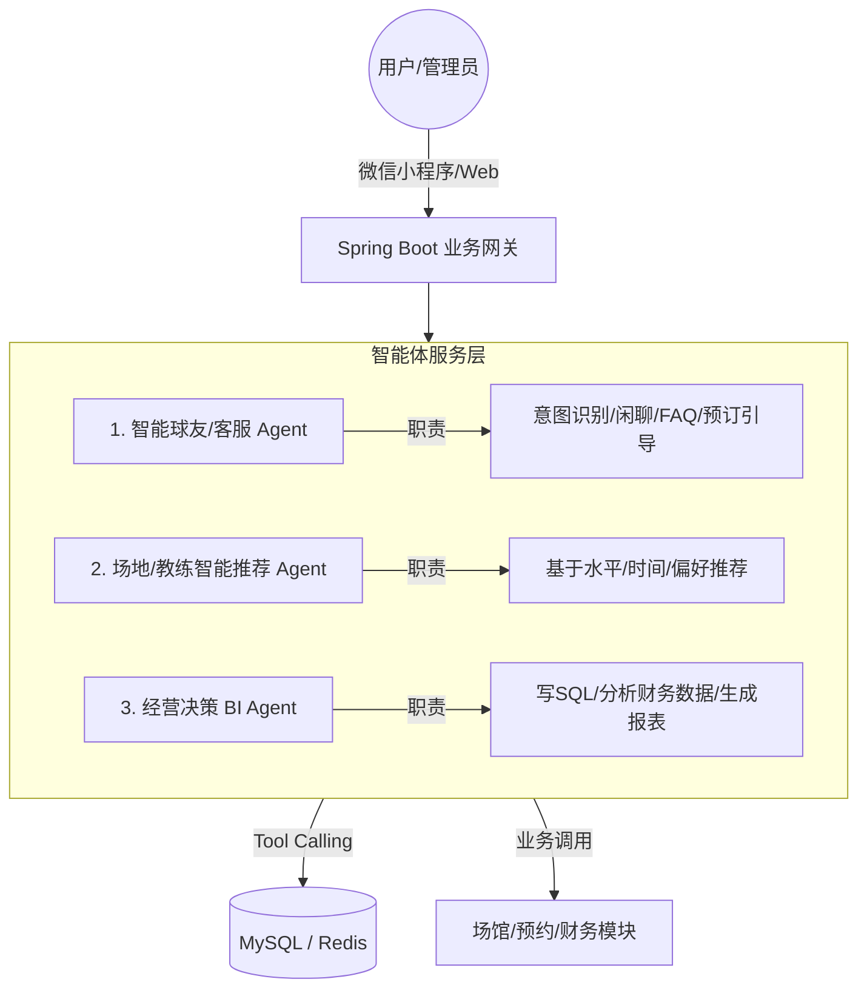
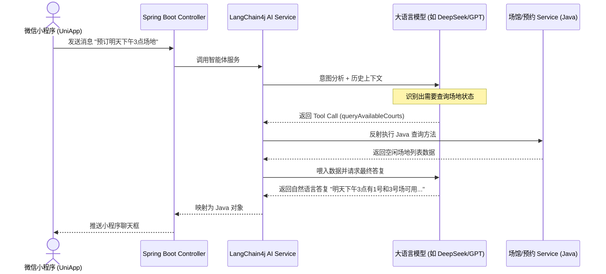
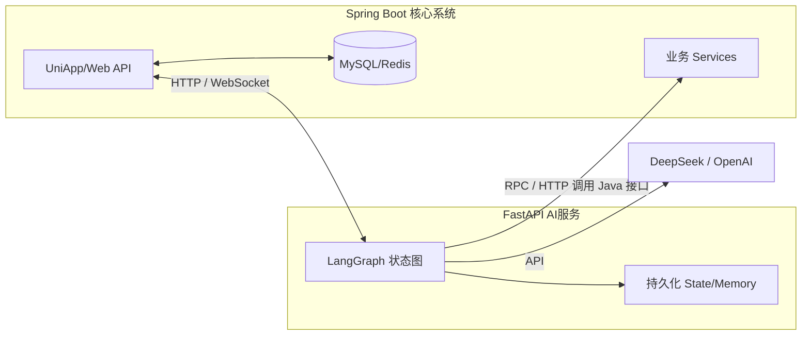

# 智能体（Agent）开发转型与架构选型分析报告

> **目标**：协助你基于现有的 **Spring Boot 3.2 + Vue 3 + UniApp** 技术栈（羽擎场馆管理系统 BMP），规划并决策向**智能体（AI Agent）开发**方向转型的技术路线。

---

## 核心选型决策矩阵

如果你想将 BMP 项目改造为支持 AI 智能体的系统，或者希望以此项目为起点转向智能体开发，以下是两种核心路线的对比：

| 维度 | 路线 A：Java + AI (单一技术栈) | 路线 B：Java + Python (混合技术栈) |
| :--- | :--- | :--- |
| **核心框架** | **LangChain4j**、**Spring AI** | **LangGraph**、**CrewAI**、**FastAPI** |
| **技术复杂度**| 🟢 **低**：无需维护第二套语言运行环境和跨进程通信。 | 🟡 **中到高**：需维护 Python 微服务、解决跨语言 RPC/REST 调用。 |
| **对现有项目的侵入性** | 🟢 **极低**：直接引入 Maven 依赖，写 Java 代码即可。 | 🟡 **低**：Spring Boot 充当网关与业务层，AI 逻辑完全剥离。 |
| **Agent 生态与上限** | 🟡 **中**：单 Agent、简单 RAG、Function Calling 体验极佳。但在**复杂多智能体协同 (Multi-Agent)**、**状态机控制**（如循环、图结构分支）上处于劣势。 | 🔴 **极高**：Python 拥有 AI 社区最前沿的 Agent 框架（如 LangGraph），支持复杂的图结构编排、长短期记忆管理与自我反思机制。 |
| **行业招聘与职业发展** | 🟡 **受限**：市面上专门招“Java AI 工程师”的极少，多为传统 Java 顺带做 AI 接入。 | 🟢 **广阔**：主流的 AI Agent 研发、LLM 微调、RAG 优化岗位 90% 以上要求熟悉 Python 生态。 |
| **推荐适用场景** | 适合**快速为现有 Java 系统增加 AI 客服、智能报表、简单工作流**，或不想学习 Python 的开发者。 | 适合**致力于成为专业 Agent 工程师**，需要构建复杂多角色协同、工作流编排，并与前沿 AI 社区保持同步的开发者。 |

> [!IMPORTANT]
> **黄金法则决策**：
> 1. 如果你的目标是**“快速为 BMP 系统赋能 AI 体验，提升项目商业价值/演示效果”** ➡️ 选择 **Java + AI (LangChain4j)**。
> 2. 如果你的目标是**“以此项目为契机，系统化转型为市场上高含金量的 AI Agent 工程师”** ➡️ 选择 **Java + Python**。

---

## 二、智能体在 BMP 项目中的落地场景

要在你当前的羽擎（BMP）系统中引入智能体，可以从以下三个由浅入深的角色切入：



### 1. 智能预订与客服智能体（面向 UniApp 小程序端）
*   **交互方式**：用户在小程序中以自然语言输入：“帮我订明天下午 3 点到 5 点的场，如果能拼场最好，没有的话帮我订单片包场。”
*   **Agent 行为**：
    1.  **意图解析**：识别出时间（明天 15:00-17:00）、场地类型（羽毛球场）、预订模式（拼场/包场优先）。
    2.  **工具调用 (Tool Calling)**：调用 Java 后端接口查询明天该时段的场地占用情况。
    3.  **多轮澄清**：如果该时段已满，主动推荐相邻时段：“明天的 3-5 点已经满了，2-4 点或者 4-6 点还有空场，您看需要预订哪一个？”
    4.  **下单确认**：调用创建订单接口，并在小程序弹出支付。

### 2. 经营决策 BI 智能体（面向 Web 管理端）
*   **交互方式**：会长（President）在后台输入：“分析一下上个月每个场地的盈利情况，找出黄金时段，并帮我出一份下个月的调价建议。”
*   **Agent 行为**：
    1.  **Schema 认知**：通过 RAG 载入你的 27 张物理表结构设计。
    2.  **SQL 生成与执行**：自动生成查询财务流水和场地预订日志的 SQL，安全地执行查询。
    3.  **分析与建议**：使用 ECharts 数据格式化输出，分析出“周五 18:00-22:00 为超黄金时段，满场率 100%”，并建议该时段价格上调 10%。

---

## 三、路线深度剖析

### 方案 A：Java + AI 直接实现 (LangChain4j / Spring AI)

在此架构下，你完全不需要引入 Python。使用 **LangChain4j**（当前 Java 生态最优秀的 LLM 框架）直接在 Spring Boot 中开发 Agent。



#### 🛠️ 关键技术栈
*   **LangChain4j**：提供了类似 Python LangChain 的 `AiServices` 声明式智能体、`@Tool` 机制、内存管理（`ChatMemory`）和 RAG 支持。
*   **Spring AI**：Spring 官方出品，完美融合 Spring Boot 3.2，支持流式输出、向量数据库检索等。

#### 💻 代码示例（声明式 Agent 概念）
```java
// 1. 定义智能体接口
@AiService
public interface BookingAgent {
    @SystemMessage("你是一个羽毛球场馆智能客服。你需要通过调用工具帮用户查询场地并下单。")
    String chat(@UserMessage String userMessage);
}

// 2. 定义智能体可以调用的 Java 工具
@Component
public class CourtBookingTools {
    @Autowired
    private CourtService courtService;

    @Tool("查询指定日期和时间段内空闲的羽毛球场地")
    public List<CourtDTO> queryAvailableCourts(String date, String startTime, String endTime) {
        return courtService.findAvailable(date, startTime, endTime);
    }
}
```

> [!TIP]
> **方案 A 优势总结**：
> *   **工程开销极小**：对于 Java 程序员来说上手仅需几小时。
> *   **性能极高**：Tool Calling 是本地方法反射调用，无网络开销，事务控制方便。

---

### 方案 B：Java + Python 异步/微服务实现

在此架构下，Java 后端退化为**传统的业务与数据中心**。所有的 AI 逻辑、Agent 状态控制流都由 Python 服务（基于 **FastAPI + LangGraph**）来承载。两者通过轻量级的 API 或消息队列进行协作。



#### 🔄 协作流程
1.  **用户请求**：用户在 UniApp 发送消息，通过 WebSocket 连入 Spring Boot。
2.  **路由分发**：Spring Boot 将消息透传给 Python FastAPI 服务。
3.  **智能体状态机运行**：Python 服务运行 **LangGraph** 状态图（例如：`用户意图检测` -> `工具节点` -> `反思节点` -> `确认节点`）。
4.  **跨语言 Tool Calling**：Python Agent 发现需要查询场地，通过 HTTP 接口回调 Java 后端的 `/api/v1/courts/available`。
5.  **状态保存与返回**：Python Agent 将对话状态（State）存入 PostgreSQL/Redis，并将结果通过 Spring Boot 推送回前端。

> [!WARNING]
> **方案 B 挑战**：
> *   **开发链路拉长**：定义一个 Tool，需要先在 Java 开发 API，再到 Python 中写 Tool 描述和 Request 调用。
> *   **部署运维成本高**：需要多部署一个 Python 容器，并处理网络通信异常。

---

## 四、智能体开发转型的核心技能树

无论选择哪条路线，转向智能体开发，你的知识结构都需要从“**确定性编程**”（增删改查、事务、并发）转向“**概率性编程**”（Prompt、大模型不确定性输出的处理、评估与纠偏）。

```
                    ┌────────────────────────┐
                    │     智能体开发技能树   │
                    └───────────┬────────────┘
                                │
         ┌──────────────────────┼──────────────────────┐
         ▼                      ▼                      ▼
  【LLM 基础与调用】      【Agent 核心模式】      【工程与 LLMOps】
  - API 接入 (Stream)    - ReAct 协同逻辑        - Vector DB (Milvus/PGVector)
  - Function Calling     - 记忆系统 (Long/Short) - RAG (混合检索/重排)
  - Prompt 模板工程      - 工作流编排 (LangGraph)- 智能体评估 (Ragas)
  - 结构化 JSON 输出      - 多智能体协作(CrewAI)  - 监控 (LangSmith/Langfuse)
```

1.  **Function Calling（函数调用）**：这是 Agent 连接现实世界的桥梁。你必须深刻理解 LLM 如何决定调用哪个工具，以及如何优雅地处理调用失败、超时和幻觉。
2.  **RAG（检索增强生成）**：Agent 处理私有数据的核心。包括文档切片（Chunking）、向量化（Embedding）、向量检索以及重排（Rerank）。
3.  **State Management（状态管理）**：在长对话和复杂工作流中，如何保存 Agent 运行的中间状态（State），允许用户打断、反悔、确认（Human-in-the-loop）。

---

## 五、给你的决策与实操建议

为了平衡**“项目落地”**与**“个人职业转型”**，我强烈建议你采用**“渐进式升级演进”**的策略，不要一上来就推翻现有的 Java 架构。

### 阶段一：快速破局（Java + LangChain4j）—— 耗时 1~2 周
*   **行动点**：在现有的 BMP 项目中，引入 `langchain4j-spring-boot-starter`。
*   **目标**：
    *   在管理端增加一个“AI 助手”侧边栏，允许管理员用自然语言查询今日场馆数据（通过定义 `@Tool` 读取后台服务）。
    *   在小程序端接入一个简单的“智能场馆客服”，能够解答“场馆几点开门”、“器材怎么租”等 FAQ（结合本地内存 RAG）。
*   **收获**：快速掌握大模型 API 对接、Function Calling、Prompt 调优与 RAG 基础，用最小代价跑通 AI 业务闭环。

### 阶段二：架构分离与能力进阶（Java + Python/LangGraph）—— 耗时 3~4 周
*   **行动点**：
    *   新建一个基于 Python FastAPI 的项目。
    *   学习并引入 **LangGraph**，将复杂的“多轮场地预订/退款工作流”移至 Python 端，用图形化的状态机（State Graph）管理对话状态。
    *   Java 后端逐步转为“服务提供者”，提供纯净的 REST API 供 Python 智能体调用。
*   **目标**：实现一个具有“反思”、“记忆”和“人类确认（Human-in-the-loop，比如预订确认扣款前需人工点击）”的高阶智能体。
*   **收获**：掌握业界最主流的 Python 智能体框架，建立正规的微服务分布式 AI 架构，为简历增添核心竞争力。

### 阶段三：LLMOps 与工程化调优 —— 持续进行
*   **行动点**：引入 **Langfuse** 或 **LangSmith** 进行智能体链路追踪，分析大模型调用延迟、Token 消耗以及幻觉发生率；使用向量数据库（如 Milvus 或 PgVector）升级 RAG 性能。

---

### 💬 互动与下一步行动建议

你觉得以上方案中，哪个更符合你**当前的精力和转型时间表**？
1.  **选项一**：先在现有 BMP 项目中，使用 **Java + LangChain4j** 快速实现一个“AI 智能球友/客服”功能，体验全流程。
2.  **选项二**：直接架设一个独立的 **Python FastAPI 智能体服务**，与 BMP 后端进行接口联调，主攻 Python 智能体方向。

如果你选定方向，我可以带你开始写第一行 Agent 代码或搭建项目结构！
