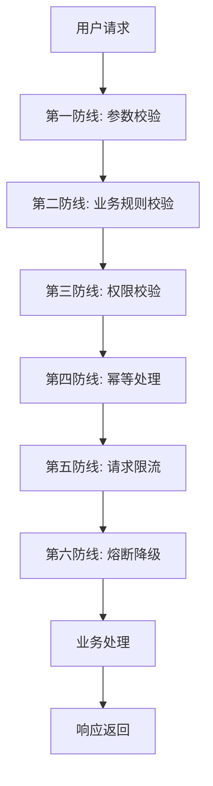

# BMP 三智能体安全防护六道防线文档

> 文档版本：v1.2
> 创建日期：2026-07-17
> 更新日期：2026-07-23
> 适用项目：羽擎（Badminton Management Platform，BMP）
> 文档状态：P1/P2-01~P2-04 已完成（六道防线与前端二次确认已全面落实）

## 1. 安全防护概览

### 1.1 六道防线架构

BMP 三智能体系统采用六道防线架构，从参数校验到熔断降级，全方位保障系统安全性和稳定性。



### 1.2 防线设计原则

- **纵深防御**：每道防线独立工作，互不依赖
- **快速失败**：尽早发现和拒绝异常请求
- **最小权限**：默认拒绝，显式授权
- **可观测性**：所有安全事件可追踪
- **优雅降级**：故障时保持核心功能可用

## 2. 第一防线：参数校验

### 2.1 目标

防止恶意或错误的输入数据进入系统，确保数据格式和范围符合预期。

### 2.2 实施策略

#### 2.2.1 双层校验机制

**Python 层（Pydantic）**

```python
from pydantic import BaseModel, Field, validator
from typing import Optional
from datetime import datetime
from enum import Enum


class AgentType(str, Enum):
    BOOKING = "booking"
    ANALYTICS = "analytics"
    SUPPORT = "support"


class CreateSessionRequest(BaseModel):
    agent_type: AgentType
    venue_id: Optional[str] = Field(None, max_length=64)
    
    @validator('venue_id')
    def validate_venue_id(cls, v):
        if v and not v.startswith('venue_'):
            raise ValueError('venue_id must start with venue_')
        return v


class SendMessageRequest(BaseModel):
    content: str = Field(..., min_length=1, max_length=2000)
    message_id: Optional[str] = Field(None, max_length=64)
    
    @validator('content')
    def validate_content(cls, v):
        # 防止注入攻击
        dangerous_patterns = ['<script', 'javascript:', 'onerror=', 'onload=']
        for pattern in dangerous_patterns:
            if pattern.lower() in v.lower():
                raise ValueError('Content contains dangerous patterns')
        return v
```

**Java 层（Jakarta Validation）**

```java
import jakarta.validation.constraints.*;
import lombok.Data;

@Data
public class CreateSessionRequest {
    @NotBlank(message = "agent_type is required")
    @Pattern(regexp = "booking|analytics|support", message = "Invalid agent_type")
    private String agentType;
    
    @Size(max = 64, message = "venue_id too long")
    @Pattern(regexp = "^venue_.*", message = "venue_id must start with venue_")
    private String venueId;
}

@Data
public class SendMessageRequest {
    @NotBlank(message = "content is required")
    @Size(min = 1, max = 2000, message = "content length must be between 1 and 2000")
    @Pattern(regexp = "(?i).*(<script|javascript:|onerror=|onload=).*", 
             message = "Content contains dangerous patterns", 
             flags = Pattern.Flag.CASE_INSENSITIVE)
    private String content;
    
    @Size(max = 64, message = "message_id too long")
    private String messageId;
}
```

#### 2.2.2 参数限制清单

| 参数类型 | 限制 | 说明 |
| --- | --- | --- |
| 消息长度 | 1-2000 字符 | 防止超长消息攻击 |
| 历史消息数 | 最多 50 条 | 防止上下文过大 |
| 时间范围 | 最多 90 天 | 防止大数据查询 |
| 分页大小 | 1-100 | 防止大量数据请求 |
| 数组数量 | 最多 100 项 | 防止数组过大 |
| 字符串长度 | 最多 255 字符 | 防止字符串过长 |
| 枚举值 | 白名单校验 | 防止非法枚举值 |

#### 2.2.3 日期时间校验

```python
from datetime import datetime, timedelta
from pydantic import validator


class BookingRequest(BaseModel):
    date: str  # YYYY-MM-DD
    start_time: str  # HH:mm
    end_time: str  # HH:mm
    
    @validator('date')
    def validate_date(cls, v):
        try:
            date_obj = datetime.strptime(v, '%Y-%m-%d').date()
        except ValueError:
            raise ValueError('Invalid date format, use YYYY-MM-DD')
        
        # 不允许过去日期
        if date_obj < datetime.now().date():
            raise ValueError('Date cannot be in the past')
        
        # 不允许超过 90 天
        if date_obj > datetime.now().date() + timedelta(days=90):
            raise ValueError('Date cannot be more than 90 days in the future')
        
        return v
    
    @validator('end_time')
    def validate_time_range(cls, v, values):
        if 'start_time' in values:
            start = values['start_time']
            if v <= start:
                raise ValueError('end_time must be after start_time')
        return v
```

### 2.3 错误处理

```python
from fastapi import HTTPException, Request
from fastapi.exceptions import RequestValidationError
from fastapi.responses import JSONResponse


async def validation_exception_handler(request: Request, exc: RequestValidationError):
    """参数校验异常处理"""
    return JSONResponse(
        status_code=400,
        content={
            "code": 1001,
            "message": "参数校验失败",
            "data": {
                "errors": [
                    {
                        "field": ".".join(str(loc) for loc in error["loc"]),
                        "message": error["msg"],
                        "type": error["type"]
                    }
                    for error in exc.errors()
                ]
            },
            "trace_id": request.state.trace_id if hasattr(request.state, "trace_id") else None
        }
    )
```

## 3. 第二防线：业务规则校验

### 3.1 目标

确保业务操作符合业务规则，防止非法业务操作。

### 3.2 实施策略

#### 3.2.1 场馆营业状态校验

```python
from datetime import datetime, time
from typing import Dict, Any


async def validate_venue_business_hours(
    venue_id: str,
    booking_date: str,
    start_time: str,
    end_time: str
) -> Dict[str, Any]:
    """校验场馆营业时间"""
    
    # 获取场馆信息
    venue_info = await get_venue_info(venue_id)
    
    if venue_info["status"] != "open":
        raise BusinessRuleError(
            "场馆当前不营业",
            details={"venue_id": venue_id, "status": venue_info["status"]}
        )
    
    # 解析时间
    booking_start = datetime.strptime(f"{booking_date} {start_time}", "%Y-%m-%d %H:%M")
    booking_end = datetime.strptime(f"{booking_date} {end_time}", "%Y-%m-%d %H:%M")
    
    # 获取营业时间
    business_open = datetime.strptime(f"{booking_date} {venue_info['business_hours']['open']}", "%Y-%m-%d %H:%M")
    business_close = datetime.strptime(f"{booking_date} {venue_info['business_hours']['close']}", "%Y-%m-%d %H:%M")
    
    # 校验营业时间
    if booking_start < business_open or booking_end > business_close:
        raise BusinessRuleError(
            "预订时间超出营业时间",
            details={
                "venue_id": venue_id,
                "booking_time": f"{start_time}-{end_time}",
                "business_hours": f"{venue_info['business_hours']['open']}-{venue_info['business_hours']['close']}"
            }
        )
    
    return venue_info
```

#### 3.2.2 场地可用性校验

```python
async def validate_court_availability(
    court_id: str,
    date: str,
    start_time: str,
    end_time: str
) -> bool:
    """校验场地可用性"""
    
    # 查询场地状态
    court_status = await get_court_status(court_id, date)
    
    if court_status["status"] != "available":
        raise BusinessRuleError(
            "场地当前不可用",
            details={
                "court_id": court_id,
                "status": court_status["status"]
            }
        )
    
    # 检查时间冲突
    conflicts = await check_booking_conflicts(court_id, date, start_time, end_time)
    if conflicts:
        raise BusinessRuleError(
            "场地已被预订",
            details={
                "court_id": court_id,
                "conflicts": conflicts
            }
        )
    
    return True
```

#### 3.2.3 价格有效性校验

```python
async def validate_price_validity(
    venue_id: str,
    court_id: str,
    date: str,
    start_time: str,
    end_time: str,
    expected_price: float
) -> bool:
    """校验价格有效性"""
    
    # 计算正确价格
    calculated_price = await calculate_booking_price(
        venue_id, court_id, date, start_time, end_time
    )
    
    # 价格偏差不能超过 1%
    price_diff = abs(calculated_price - expected_price)
    if price_diff / calculated_price > 0.01:
        raise BusinessRuleError(
            "价格不匹配",
            details={
                "expected_price": expected_price,
                "calculated_price": calculated_price,
                "difference": price_diff
            }
        )
    
    return True
```

#### 3.2.4 统计指标白名单校验

```python
ALLOWED_ANALYTICS_METRICS = {
    "total_bookings",
    "total_revenue",
    "occupancy_rate",
    "booking_trend",
    "finance_trend",
    "business_ratio",
    "venue_comparison"
}


def validate_analytics_metrics(metrics: list[str]) -> list[str]:
    """校验分析指标白名单"""
    
    invalid_metrics = [m for m in metrics if m not in ALLOWED_ANALYTICS_METRICS]
    
    if invalid_metrics:
        raise BusinessRuleError(
            "不支持的分析指标",
            details={
                "invalid_metrics": invalid_metrics,
                "allowed_metrics": list(ALLOWED_ANALYTICS_METRICS)
            }
        )
    
    return metrics
```

### 3.3 业务规则清单

| 规则类型 | 校验内容 | 错误码 |
| --- | --- | --- |
| 场馆状态 | 场馆是否营业 | 1002 |
| 营业时间 | 预订时间是否在营业时间内 | 1002 |
| 场地状态 | 场地是否可用 | 1002 |
| 时间冲突 | 场地是否已被预订 | 1002 |
| 价格校验 | 价格是否正确 | 1002 |
| 库存校验 | 库存是否充足 | 1002 |
| 指标白名单 | 统计指标是否在白名单内 | 1002 |
| 时间范围 | 统计时间范围是否合法 | 1002 |

## 4. 第三防线：权限校验

### 4.1 目标

确保用户只能访问和操作其权限范围内的资源。

### 4.2 实施策略

#### 4.2.1 多层身份认证

**Spring Boot Agent 网关层**

```java
import org.springframework.security.core.annotation.AuthenticationPrincipal;
import org.springframework.security.oauth2.jwt.Jwt;


@RestController
@RequestMapping("/api/agent")
public class AgentGatewayController {
    
    @PostMapping("/conversations")
    public ResponseEntity<?> createConversation(
        @RequestBody CreateSessionRequest request,
        @AuthenticationPrincipal Jwt jwt
    ) {
        // 从 JWT 解析用户信息
        String userId = jwt.getSubject();
        String role = jwt.getClaimAsString("role");
        String venueId = jwt.getClaimAsString("venue_id");
        
        // 验证用户状态
        if (!userService.isUserActive(userId)) {
            throw new AuthenticationException("User is not active");
        }
        
        // 生成短期签名的 Agent 上下文
        AgentContext context = agentContextService.createContext(
            userId, role, venueId
        );
        
        // 调用 FastAPI 服务
        return agentServiceClient.createConversation(request, context);
    }
}
```

**Tool API 层**

```python
from fastapi import Header, HTTPException
from typing import Optional


async def verify_agent_service(
    x_agent_service_key: str = Header(...),
    x_agent_context_signature: str = Header(...),
    x_agent_trace_id: str = Header(...),
    x_agent_user_id: str = Header(...),
    x_agent_user_role: str = Header(...),
    x_agent_venue_id: Optional[str] = Header(None)
) -> Dict[str, str]:
    """验证 Agent 服务身份和用户上下文"""
    
    # 验证服务密钥
    if not verify_service_key(x_agent_service_key):
        raise HTTPException(
            status_code=401,
            detail="Invalid service key"
        )
    
    # 验证上下文签名
    if not verify_context_signature(
        x_agent_context_signature,
        x_agent_user_id,
        x_agent_user_role,
        x_agent_venue_id
    ):
        raise HTTPException(
            status_code=401,
            detail="Invalid context signature"
        )
    
    # 验证用户状态
    if not await is_user_active(x_agent_user_id):
        raise HTTPException(
            status_code=401,
            detail="User is not active"
        )
    
    return {
        "user_id": x_agent_user_id,
        "role": x_agent_user_role,
        "venue_id": x_agent_venue_id,
        "trace_id": x_agent_trace_id
    }


def verify_service_key(service_key: str) -> bool:
    """验证服务密钥"""
    expected_key = settings.agent_service_key
    return service_key == expected_key


def verify_context_signature(
    signature: str,
    user_id: str,
    role: str,
    venue_id: Optional[str]
) -> bool:
    """验证上下文签名"""
    import hmac
    import hashlib
    
    # 构造签名内容
    content = f"{user_id}:{role}:{venue_id or ''}"
    
    # 计算预期签名
    expected_signature = hmac.new(
        settings.agent_context_secret.encode(),
        content.encode(),
        hashlib.sha256
    ).hexdigest()
    
    # 使用恒定时间比较防止时序攻击
    return hmac.compare_digest(signature, expected_signature)
```

#### 4.2.2 资源归属校验

```python
async def verify_resource_ownership(
    user_id: str,
    role: str,
    resource_id: str,
    resource_type: str
) -> bool:
    """校验资源归属"""
    
    if resource_type == "conversation":
        # 用户只能访问自己的会话
        conversation = await get_conversation(resource_id)
        if conversation["user_id"] != user_id:
            raise PermissionError("No permission to access this conversation")
    
    elif resource_type == "booking":
        # 用户只能访问自己的预约，管理员可以访问场馆内的预约
        booking = await get_booking(resource_id)
        if role == "USER" or role == "MEMBER":
            if booking["user_id"] != user_id:
                raise PermissionError("No permission to access this booking")
        elif role == "VENUE_MANAGER":
            if booking["venue_id"] != get_user_venue_id(user_id):
                raise PermissionError("No permission to access this booking")
    
    return True
```

#### 4.2.3 角色权限矩阵

| 角色 | 预订操作 | 经营分析 | 场馆客服 | 跨场馆访问 |
| --- | --- | --- | --- | --- |
| USER | 本人数据 | 否 | 是 | 否 |
| MEMBER | 本人数据 | 否 | 是 | 否 |
| VENUE_MANAGER | 场馆内数据 | 场馆内数据 | 是 | 否 |
| PRESIDENT | 全部数据 | 全部数据 | 是 | 是 |

#### 4.2.4 Tool 白名单校验

```python
AGENT_TOOL_WHITELIST = {
    "booking": [
        "query_venues",
        "query_court_availability",
        "generate_booking_quote",
        "create_booking",
        "query_booking_result"
    ],
    "analytics": [
        "analytics_summary",
        "analytics_booking_trend",
        "analytics_occupancy_heatmap",
        "analytics_finance_trend",
        "analytics_business_ratio",
        "analytics_venue_comparison"
    ],
    "support": [
        "query_venue_info",
        "query_venue_prices",
        "create_handoff"
    ]
}


def verify_tool_access(agent_type: str, tool_name: str) -> bool:
    """校验 Tool 访问权限"""
    
    allowed_tools = AGENT_TOOL_WHITELIST.get(agent_type, [])
    
    if tool_name not in allowed_tools:
        raise PermissionError(
            f"Agent {agent_type} is not allowed to call tool {tool_name}"
        )
    
    return True
```

### 4.3 权限校验流程

```python
from fastapi import Depends


async def check_permission(
    context: Dict = Depends(verify_agent_service),
    tool_name: str = None
):
    """综合权限校验"""
    
    user_id = context["user_id"]
    role = context["role"]
    venue_id = context["venue_id"]
    agent_type = context.get("agent_type")
    
    # 校验 Tool 白名单
    if tool_name and agent_type:
        verify_tool_access(agent_type, tool_name)
    
    # 校验场馆权限
    if role == "VENUE_MANAGER" and venue_id:
        if not await verify_venue_access(user_id, venue_id):
            raise PermissionError("No permission to access this venue")
    
    # 校验跨场馆权限
    if role != "PRESIDENT":
        # 非会长不能跨场馆操作
        pass
    
    return context
```

## 5. 第四防线：幂等处理

### 5.1 目标

防止重复操作导致的数据不一致，确保相同请求只产生一次效果。

### 5.2 实施策略

#### 5.2.1 幂等键生成

```python
import uuid
import hashlib


def generate_idempotency_key(
    user_id: str,
    operation: str,
    params: dict
) -> str:
    """生成幂等键"""
    
    # 构造唯一标识
    unique_string = f"{user_id}:{operation}:{json.dumps(params, sort_keys=True)}"
    
    # 生成哈希
    hash_value = hashlib.sha256(unique_string.encode()).hexdigest()
    
    return f"idemp_{hash_value[:32]}"


# 客户端生成幂等键
client_idempotency_key = generate_idempotency_key(
    user_id="user_123",
    operation="create_booking",
    params={
        "venue_id": "venue_123",
        "court_id": "court_1",
        "date": "2026-07-18",
        "start_time": "15:00",
        "end_time": "16:00"
    }
)
```

#### 5.2.2 Redis 幂等存储

```python
import redis
import json
from typing import Optional


class IdempotencyManager:
    """幂等管理器"""
    
    def __init__(self, redis_client: redis.Redis):
        self.redis = redis_client
    
    async def check_and_set(
        self,
        idempotency_key: str,
        ttl: int = 86400
    ) -> Optional[dict]:
        """检查并设置幂等键"""
        
        # 检查是否已存在
        existing = self.redis.get(f"idempotency:{idempotency_key}")
        if existing:
            return json.loads(existing)
        
        # 设置新键
        self.redis.setex(
            f"idempotency:{idempotency_key}",
            ttl,
            json.dumps({"status": "processing"})
        )
        
        return None
    
    async def update_result(
        self,
        idempotency_key: str,
        result: dict,
        ttl: int = 86400
    ):
        """更新幂等结果"""
        
        self.redis.setex(
            f"idempotency:{idempotency_key}",
            ttl,
            json.dumps({
                "status": "completed",
                "result": result
            })
        )
    
    async def mark_failed(
        self,
        idempotency_key: str,
        error: str,
        ttl: int = 3600
    ):
        """标记幂等失败"""
        
        self.redis.setex(
            f"idempotency:{idempotency_key}",
            ttl,
            json.dumps({
                "status": "failed",
                "error": error
            })
        )
```

#### 5.2.3 数据库唯一约束

```sql
-- 预约表添加唯一约束
ALTER TABLE bookings 
ADD CONSTRAINT uk_user_court_time 
UNIQUE (user_id, court_id, booking_date, start_time, end_time);

-- 幂等键表
CREATE TABLE idempotency_keys (
    id UUID PRIMARY KEY DEFAULT gen_random_uuid(),
    idempotency_key VARCHAR(128) UNIQUE NOT NULL,
    user_id VARCHAR(64) NOT NULL,
    operation VARCHAR(64) NOT NULL,
    status VARCHAR(32) NOT NULL,
    result JSONB,
    error_message TEXT,
    created_at TIMESTAMP WITH TIME ZONE DEFAULT CURRENT_TIMESTAMP,
    expires_at TIMESTAMP WITH TIME ZONE NOT NULL
);

CREATE INDEX idx_idempotency_keys_key ON idempotency_keys(idempotency_key);
CREATE INDEX idx_idempotency_keys_user ON idempotency_keys(user_id);
```

#### 5.2.4 动作状态机

```python
class ActionStateMachine:
    """动作状态机"""
    
    VALID_TRANSITIONS = {
        "PENDING": ["CONFIRMED", "REJECTED", "EXPIRED"],
        "CONFIRMED": [],  # 终态
        "REJECTED": [],   # 终态
        "EXPIRED": []     # 终态
    }
    
    @classmethod
    def can_transition(cls, from_state: str, to_state: str) -> bool:
        """检查状态转换是否合法"""
        return to_state in cls.VALID_TRANSITIONS.get(from_state, [])
    
    @classmethod
    def transition(cls, current_state: str, new_state: str) -> str:
        """执行状态转换"""
        if not cls.can_transition(current_state, new_state):
            raise ValueError(f"Invalid state transition: {current_state} -> {new_state}")
        return new_state


# 使用示例
action = await get_action(action_id)
new_status = ActionStateMachine.transition(
    action["status"],
    "CONFIRMED"
)
await update_action_status(action_id, new_status)
```

### 5.3 幂等处理流程

```python
from fastapi import Header, HTTPException


async def create_booking_with_idempotency(
    request: CreateBookingRequest,
    x_idempotency_key: str = Header(...)
):
    """带幂等的创建预约"""
    
    # 检查幂等键
    existing_result = await idempotency_manager.check_and_set(x_idempotency_key)
    
    if existing_result:
        # 返回已有结果
        if existing_result["status"] == "completed":
            return existing_result["result"]
        elif existing_result["status"] == "processing":
            raise HTTPException(status_code=409, detail="Request is processing")
        else:
            raise HTTPException(status_code=400, detail=existing_result["error"])
    
    try:
        # 执行业务逻辑
        result = await create_booking(request)
        
        # 更新幂等结果
        await idempotency_manager.update_result(x_idempotency_key, result)
        
        return result
    
    except Exception as e:
        # 标记失败
        await idempotency_manager.mark_failed(x_idempotency_key, str(e))
        raise
```

## 6. 第五防线：请求限流

### 6.1 目标

防止系统过载，保护服务稳定性，防止恶意攻击。

### 6.2 实施策略

#### 6.2.1 多维度限流

```python
from redis import Redis
from typing import Optional


class RateLimiter:
    """限流器"""
    
    def __init__(self, redis_client: Redis):
        self.redis = redis_client
    
    async def check_rate_limit(
        self,
        key: str,
        limit: int,
        window: int
    ) -> bool:
        """
        检查限流
        
        Args:
            key: 限流键
            limit: 限制数量
            window: 时间窗口（秒）
        
        Returns:
            是否允许请求
        """
        
        # 使用 Redis + Lua 实现令牌桶
        lua_script = """
        local key = KEYS[1]
        local limit = tonumber(ARGV[1])
        local window = tonumber(ARGV[2])
        local current = redis.call('GET', key)
        
        if current == false then
            redis.call('SET', key, 1)
            redis.call('EXPIRE', key, window)
            return 1
        else
            local count = tonumber(current)
            if count < limit then
                redis.call('INCR', key)
                return 1
            else
                return 0
            end
        end
        """
        
        result = self.redis.eval(
            lua_script,
            1,
            f"ratelimit:{key}",
            limit,
            window
        )
        
        return result == 1


# 使用示例
rate_limiter = RateLimiter(redis_client)

# 用户对话频率限制
user_key = f"user:{user_id}:conversation"
if not await rate_limiter.check_rate_limit(user_key, limit=10, window=60):
    raise HTTPException(status_code=429, detail="Too many conversations")

# Tool 写操作限制
tool_key = f"tool:{tool_name}:write"
if not await rate_limiter.check_rate_limit(tool_key, limit=5, window=60):
    raise HTTPException(status_code=429, detail="Too many write operations")
```

#### 6.2.2 限流配置

| 限流维度 | 限制 | 时间窗口 | 优先级 |
| --- | --- | --- | --- |
| 用户对话频率 | 10 次/分钟 | 60 秒 | 高 |
| 用户并发会话 | 5 个 | - | 高 |
| 每日模型预算 | 100,000 tokens | 24 小时 | 高 |
| IP 请求频率 | 100 次/分钟 | 60 秒 | 中 |
| Tool 写操作 | 5 次/分钟 | 60 秒 | 高 |
| Tool 读操作 | 50 次/分钟 | 60 秒 | 中 |
| 全局请求 | 10,000 次/分钟 | 60 秒 | 低 |

#### 6.2.3 令牌桶算法

```python
import time
from typing import Optional


class TokenBucket:
    """令牌桶限流器"""
    
    def __init__(
        self,
        capacity: int,
        refill_rate: float,
        redis_client: Optional[Redis] = None
    ):
        self.capacity = capacity
        self.refill_rate = refill_rate  # tokens per second
        self.redis = redis_client
        
        if not redis_client:
            # 内存模式
            self.tokens = capacity
            self.last_refill = time.time()
    
    async def consume(self, tokens: int = 1) -> bool:
        """消费令牌"""
        
        if self.redis:
            return await self._consume_redis(tokens)
        else:
            return self._consume_memory(tokens)
    
    def _consume_memory(self, tokens: int) -> bool:
        """内存模式消费"""
        
        now = time.time()
        
        # 补充令牌
        elapsed = now - self.last_refill
        refill_amount = elapsed * self.refill_rate
        self.tokens = min(self.capacity, self.tokens + refill_amount)
        self.last_refill = now
        
        # 检查令牌
        if self.tokens >= tokens:
            self.tokens -= tokens
            return True
        
        return False
    
    async def _consume_redis(self, tokens: int) -> bool:
        """Redis 模式消费"""
        
        lua_script = """
        local key = KEYS[1]
        local capacity = tonumber(ARGV[1])
        local refill_rate = tonumber(ARGV[2])
        local tokens = tonumber(ARGV[3])
        local now = tonumber(ARGV[4])
        
        local data = redis.call('HMGET', key, 'tokens', 'last_refill')
        local current_tokens = tonumber(data[1]) or capacity
        local last_refill = tonumber(data[2]) or now
        
        -- 补充令牌
        local elapsed = now - last_refill
        local refill_amount = elapsed * refill_rate
        current_tokens = math.min(capacity, current_tokens + refill_amount)
        
        -- 消费令牌
        if current_tokens >= tokens then
            current_tokens = current_tokens - tokens
            redis.call('HMSET', key, 'tokens', current_tokens, 'last_refill', now)
            redis.call('EXPIRE', key, 3600)
            return 1
        else
            redis.call('HMSET', key, 'tokens', current_tokens, 'last_refill', now)
            redis.call('EXPIRE', key, 3600)
            return 0
        end
        """
        
        result = self.redis.eval(
            lua_script,
            1,
            f"tokenbucket:{self.key}",
            self.capacity,
            self.refill_rate,
            tokens,
            time.time()
        )
        
        return result == 1
```

#### 6.2.4 滑动窗口算法

```python
class SlidingWindowRateLimiter:
    """滑动窗口限流器"""
    
    def __init__(self, redis_client: Redis):
        self.redis = redis_client
    
    async def check_rate_limit(
        self,
        key: str,
        limit: int,
        window: int
    ) -> bool:
        """
        检查滑动窗口限流
        
        Args:
            key: 限流键
            limit: 限制数量
            window: 时间窗口（秒）
        """
        
        now = time.time()
        window_start = now - window
        
        lua_script = """
        local key = KEYS[1]
        local limit = tonumber(ARGV[1])
        local window = tonumber(ARGV[2])
        local now = tonumber(ARGV[3])
        local window_start = now - window
        
        -- 删除窗口外的记录
        redis.call('ZREMRANGEBYSCORE', key, 0, window_start)
        
        -- 获取当前窗口内的请求数
        local current = redis.call('ZCARD', key)
        
        if current < limit then
            -- 添加当前请求
            redis.call('ZADD', key, now, now)
            redis.call('EXPIRE', key, window)
            return 1
        else
            return 0
        end
        """
        
        result = self.redis.eval(
            lua_script,
            1,
            f"slidingwindow:{key}",
            limit,
            window,
            now
        )
        
        return result == 1
```

### 6.3 限流响应

```python
from fastapi import HTTPException


async def rate_limit_middleware(
    request: Request,
    call_next
):
    """限流中间件"""
    
    # 获取用户 ID
    user_id = request.state.user_id if hasattr(request.state, "user_id") else None
    ip_address = request.client.host
    
    # 检查用户限流
    if user_id:
        user_key = f"user:{user_id}:request"
        if not await rate_limiter.check_rate_limit(user_key, limit=100, window=60):
            raise HTTPException(
                status_code=429,
                headers={
                    "X-RateLimit-Limit": "100",
                    "X-RateLimit-Remaining": "0",
                    "X-RateLimit-Reset": str(int(time.time()) + 60)
                }
            )
    
    # 检查 IP 限流
    ip_key = f"ip:{ip_address}:request"
    if not await rate_limiter.check_rate_limit(ip_key, limit=200, window=60):
        raise HTTPException(
            status_code=429,
            headers={
                "X-RateLimit-Limit": "200",
                "X-RateLimit-Remaining": "0",
                "X-RateLimit-Reset": str(int(time.time()) + 60)
            }
        )
    
    response = await call_next(request)
    return response
```

## 7. 第六防线：熔断降级与统一异常

### 7.1 目标

在服务异常时保护系统稳定性，提供优雅降级，统一异常处理。

### 7.2 实施策略

#### 7.2.1 熔断器模式

```python
from enum import Enum
from typing import Callable
import time


class CircuitState(Enum):
    """熔断器状态"""
    CLOSED = "closed"      # 关闭（正常）
    OPEN = "open"          # 开启（熔断）
    HALF_OPEN = "half_open"  # 半开（试探）


class CircuitBreaker:
    """熔断器"""
    
    def __init__(
        self,
        failure_threshold: int = 5,
        timeout: int = 60,
        half_open_max_calls: int = 3
    ):
        self.failure_threshold = failure_threshold
        self.timeout = timeout
        self.half_open_max_calls = half_open_max_calls
        
        self.state = CircuitState.CLOSED
        self.failure_count = 0
        self.last_failure_time = None
        self.half_open_call_count = 0
    
    async def call(self, func: Callable, *args, **kwargs):
        """通过熔断器调用函数"""
        
        if self.state == CircuitState.OPEN:
            # 检查是否可以进入半开状态
            if time.time() - self.last_failure_time > self.timeout:
                self.state = CircuitState.HALF_OPEN
                self.half_open_call_count = 0
            else:
                raise CircuitBreakerOpenError("Circuit breaker is OPEN")
        
        try:
            result = await func(*args, **kwargs)
            
            # 成功调用
            if self.state == CircuitState.HALF_OPEN:
                self.half_open_call_count += 1
                if self.half_open_call_count >= self.half_open_max_calls:
                    self.state = CircuitState.CLOSED
                    self.failure_count = 0
            
            return result
        
        except Exception as e:
            # 失败调用
            self.failure_count += 1
            self.last_failure_time = time.time()
            
            if self.failure_count >= self.failure_threshold:
                self.state = CircuitState.OPEN
            
            raise


# 使用示例
llm_circuit_breaker = CircuitBreaker(failure_threshold=5, timeout=60)

async def call_llm_with_circuit_breaker(messages):
    return await llm_circuit_breaker.call(llm_client.generate, messages)
```

#### 7.2.2 超时控制

```python
import asyncio
from typing import Callable, Any


async def with_timeout(
    func: Callable,
    timeout: float,
    *args,
    **kwargs
) -> Any:
    """带超时的函数调用"""
    
    try:
        return await asyncio.wait_for(
            func(*args, **kwargs),
            timeout=timeout
        )
    except asyncio.TimeoutError:
        raise TimeoutError(f"Operation timed out after {timeout} seconds")


# 使用示例
try:
    result = await with_timeout(
        llm_client.generate,
        timeout=30.0,
        messages=messages
    )
except TimeoutError:
    # 超时处理
    pass
```

#### 7.2.3 重试机制

```python
import asyncio
from typing import Callable, Optional
import random


class RetryPolicy:
    """重试策略"""
    
    def __init__(
        self,
        max_attempts: int = 3,
        base_delay: float = 1.0,
        max_delay: float = 10.0,
        backoff_factor: float = 2.0
    ):
        self.max_attempts = max_attempts
        self.base_delay = base_delay
        self.max_delay = max_delay
        self.backoff_factor = backoff_factor
    
    def get_delay(self, attempt: int) -> float:
        """获取重试延迟（指数退避 + 抖动）"""
        delay = min(
            self.base_delay * (self.backoff_factor ** (attempt - 1)),
            self.max_delay
        )
        # 添加抖动
        jitter = delay * 0.1 * random.random()
        return delay + jitter


async def retry_with_policy(
    func: Callable,
    policy: RetryPolicy,
    *args,
    **kwargs
) -> Any:
    """带重试策略的函数调用"""
    
    last_exception = None
    
    for attempt in range(1, policy.max_attempts + 1):
        try:
            return await func(*args, **kwargs)
        
        except Exception as e:
            last_exception = e
            
            if attempt == policy.max_attempts:
                break
            
            delay = policy.get_delay(attempt)
            await asyncio.sleep(delay)
    
    raise last_exception


# 使用示例
retry_policy = RetryPolicy(max_attempts=3, base_delay=1.0)

try:
    result = await retry_with_policy(
        tool_client.call,
        retry_policy,
        tool_name="query_venues",
        params={}
    )
except Exception as e:
    # 重试失败处理
    pass
```

#### 7.2.4 降级策略

```python
from typing import Dict, Any


class DegradationStrategy:
    """降级策略"""
    
    @staticmethod
    async def booking_agent_fallback(user_input: str) -> Dict[str, Any]:
        """预订 Agent 降级"""
        return {
            "response": "智能预订服务暂时不可用，请使用传统预订页面",
            "type": "error",
            "fallback_url": "/booking",
            "requires_action": False
        }
    
    @staticmethod
    async def analytics_agent_fallback(user_input: str) -> Dict[str, Any]:
        """分析 Agent 降级"""
        return {
            "response": "经营分析服务暂时不可用，请使用现有 Dashboard",
            "type": "error",
            "fallback_url": "/analytics",
            "requires_action": False
        }
    
    @staticmethod
    async def support_agent_fallback(user_input: str) -> Dict[str, Any]:
        """客服 Agent 降级"""
        return {
            "response": "智能客服暂时不可用，以下是常见问题 FAQ...",
            "type": "text",
            "faq_url": "/faq",
            "requires_action": False
        }


# 使用示例
try:
    result = await booking_agent.run(user_input)
except (CircuitBreakerOpenError, TimeoutError) as e:
    result = await DegradationStrategy.booking_agent_fallback(user_input)
```

#### 7.2.5 统一异常处理

```python
from fastapi import Request, HTTPException
from fastapi.responses import JSONResponse
from app.core.exceptions import AgentException


async def agent_exception_handler(request: Request, exc: AgentException) -> JSONResponse:
    """Agent 异常统一处理"""
    
    return JSONResponse(
        status_code=500,
        content={
            "code": exc.code,
            "message": exc.message,
            "data": exc.details,
            "trace_id": exc.trace_id or request.state.trace_id if hasattr(request.state, "trace_id") else None
        }
    )


async def general_exception_handler(request: Request, exc: Exception) -> JSONResponse:
    """通用异常处理"""
    
    # 记录错误日志
    logger.error(
        f"Unhandled exception: {exc}",
        trace_id=request.state.trace_id if hasattr(request.state, "trace_id") else None,
        exc_info=True
    )
    
    return JSONResponse(
        status_code=500,
        content={
            "code": 5001,
            "message": "内部服务错误",
            "data": None,
            "trace_id": request.state.trace_id if hasattr(request.state, "trace_id") else None
        }
    )


# 注册异常处理器
app.add_exception_handler(AgentException, agent_exception_handler)
app.add_exception_handler(Exception, general_exception_handler)
```

### 7.3 服务健康检查

```python
from fastapi import APIRouter
from typing import Dict


router = APIRouter()


@router.get("/health")
async def health_check() -> Dict[str, Any]:
    """健康检查"""
    
    health_status = {
        "status": "healthy",
        "timestamp": time.time(),
        "services": {}
    }
    
    # 检查 LLM 服务
    try:
        await llm_client.health_check()
        health_status["services"]["llm"] = "healthy"
    except Exception:
        health_status["services"]["llm"] = "unhealthy"
        health_status["status"] = "degraded"
    
    # 检查数据库
    try:
        await database.health_check()
        health_status["services"]["database"] = "healthy"
    except Exception:
        health_status["services"]["database"] = "unhealthy"
        health_status["status"] = "degraded"
    
    # 检查 Redis
    try:
        await redis.ping()
        health_status["services"]["redis"] = "healthy"
    except Exception:
        health_status["services"]["redis"] = "unhealthy"
        health_status["status"] = "degraded"
    
    # 检查 Java Tool 服务
    try:
        await tool_client.health_check()
        health_status["services"]["java_tools"] = "healthy"
    except Exception:
        health_status["services"]["java_tools"] = "unhealthy"
        health_status["status"] = "degraded"
    
    return health_status
```

## 8. 安全监控与审计

### 8.1 安全事件监控

```python
from enum import Enum


class SecurityEventType(Enum):
    """安全事件类型"""
    AUTH_FAILURE = "auth_failure"
    PERMISSION_DENIED = "permission_denied"
    RATE_LIMIT_EXCEEDED = "rate_limit_exceeded"
    INJECTION_ATTEMPT = "injection_attempt"
    ABNORMAL_REQUEST = "abnormal_request"


class SecurityMonitor:
    """安全监控"""
    
    def __init__(self, redis_client: Redis):
        self.redis = redis_client
    
    async def log_security_event(
        self,
        event_type: SecurityEventType,
        user_id: Optional[str],
        ip_address: str,
        details: dict
    ):
        """记录安全事件"""
        
        event = {
            "event_type": event_type.value,
            "user_id": user_id,
            "ip_address": ip_address,
            "details": details,
            "timestamp": time.time()
        }
        
        # 存储到 Redis
        self.redis.lpush("security_events", json.dumps(event))
        self.redis.ltrim("security_events", 0, 9999)  # 保留最近 10000 条
        
        # 记录到日志
        logger.warning(
            f"Security event: {event_type.value}",
            user_id=user_id,
            ip_address=ip_address,
            details=details
        )
    
    async def check_suspicious_activity(self, user_id: str) -> bool:
        """检查可疑活动"""
        
        # 检查最近的安全事件
        events = self.redis.lrange("security_events", 0, 100)
        
        user_events = [
            json.loads(event) 
            for event in events 
            if json.loads(event).get("user_id") == user_id
        ]
        
        # 如果最近有多次安全事件，标记为可疑
        if len(user_events) > 5:
            return True
        
        return False
```

### 8.2 审计日志

```python
class AuditLogger:
    """审计日志记录器"""
    
    def __init__(self, database):
        self.database = database
    
    async def log_tool_call(
        self,
        trace_id: str,
        user_id: str,
        tool_name: str,
        request_payload: dict,
        response_payload: dict,
        status: str,
        duration_ms: int
    ):
        """记录 Tool 调用"""
        
        await self.database.execute("""
            INSERT INTO tool_call_logs 
            (trace_id, user_id, tool_name, request_payload, response_payload, status, duration_ms)
            VALUES ($1, $2, $3, $4, $5, $6, $7)
        """, trace_id, user_id, tool_name, request_payload, response_payload, status, duration_ms)
    
    async def log_write_operation(
        self,
        trace_id: str,
        user_id: str,
        operation: str,
        resource_id: str,
        original_data: dict,
        result_data: dict
    ):
        """记录写操作"""
        
        await self.database.execute("""
            INSERT INTO audit_logs 
            (trace_id, user_id, operation, resource_id, original_data, result_data)
            VALUES ($1, $2, $3, $4, $5, $6)
        """, trace_id, user_id, operation, resource_id, original_data, result_data)
```

## 9. 安全最佳实践

### 9.1 数据保护

- **最小化原则**：只收集和处理必要的用户数据
- **数据脱敏**：日志中敏感信息脱敏处理
- **加密存储**：敏感数据加密存储
- **传输加密**：所有通信使用 HTTPS/TLS

### 9.2 输入验证

- **白名单验证**：枚举值使用白名单验证
- **长度限制**：所有输入字段设置长度限制
- **格式验证**：日期、时间、邮箱等格式验证
- **注入防护**：防止 SQL 注入、XSS、命令注入

### 9.3 访问控制

- **最小权限**：默认拒绝，显式授权
- **权限分离**：读写权限分离
- **资源隔离**：用户数据严格隔离
- **审计追踪**：所有操作可审计

### 9.4 错误处理

- **统一格式**：所有错误使用统一格式
- **信息隐藏**：不向用户暴露系统内部信息
- **日志记录**：详细记录错误信息
- **优雅降级**：故障时保持核心功能

## 10. 安全检查清单

### 10.1 开发阶段

- [ ] 所有输入参数都有校验
- [ ] 所有 API 都有权限检查
- [ ] 敏感数据不记录到日志
- [ ] 错误信息不暴露内部细节
- [ ] 所有写操作都有幂等保护
- [ ] 所有限流规则已配置
- [ ] 熔断降级策略已实现

### 10.2 测试阶段

- [ ] 参数校验测试覆盖
- [ ] 权限校验测试覆盖
- [ ] 幂等性测试覆盖
- [ ] 限流测试覆盖
- [ ] 熔断测试覆盖
- [ ] 降级测试覆盖
- [ ] 安全漏洞扫描

### 10.3 部署阶段

- [ ] 环境变量配置正确
- [ ] 密钥管理安全
- [ ] 数据库访问权限最小化
- [ ] 网络隔离配置
- [ ] 监控告警配置
- [ ] 备份恢复测试
- [ ] 安全审计配置

## 11. 附录

### 11.1 安全相关配置

```python
# 安全配置
SECURITY_CONFIG = {
    # 密钥配置
    "agent_service_key": "${AGENT_SERVICE_KEY}",
    "agent_context_secret": "${AGENT_CONTEXT_SECRET}",
    
    # JWT 配置
    "jwt_secret": "${JWT_SECRET}",
    "jwt_algorithm": "HS256",
    "jwt_expiration": 3600,
    
    # 限流配置
    "rate_limits": {
        "user_conversation": {"limit": 10, "window": 60},
        "user_concurrent_sessions": {"limit": 5},
        "tool_write": {"limit": 5, "window": 60},
        "tool_read": {"limit": 50, "window": 60},
    },
    
    # 熔断配置
    "circuit_breaker": {
        "failure_threshold": 5,
        "timeout": 60,
        "half_open_max_calls": 3
    },
    
    # 超时配置
    "timeouts": {
        "llm_call": 30,
        "tool_call": 10,
        "database_query": 5
    }
}
```

### 11.2 常见安全漏洞防护

| 漏洞类型 | 防护措施 |
| --- | --- |
| SQL 注入 | 参数化查询、ORM |
| XSS | 输入过滤、输出编码 |
| CSRF | CSRF Token |
| 命令注入 | 避免命令执行、白名单 |
| SSRF | 限制目标地址、内网隔离 |
| XXE | 禁用外部实体 |
| 路径遍历 | 路径规范化、白名单 |
| 重放攻击 | 时间戳、nonce |
| 中间人攻击 | HTTPS/TLS |
| 会话劫持 | 安全 Cookie、HTTPS |
