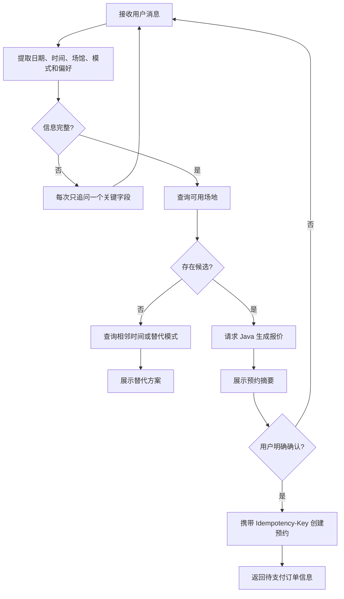
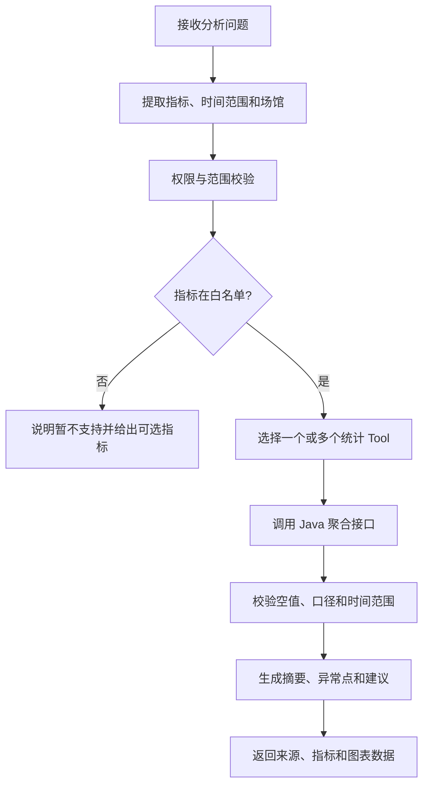
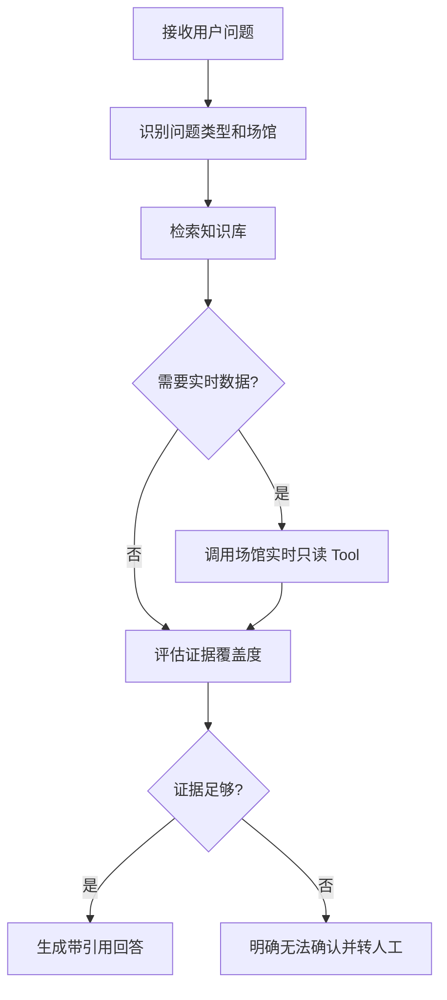
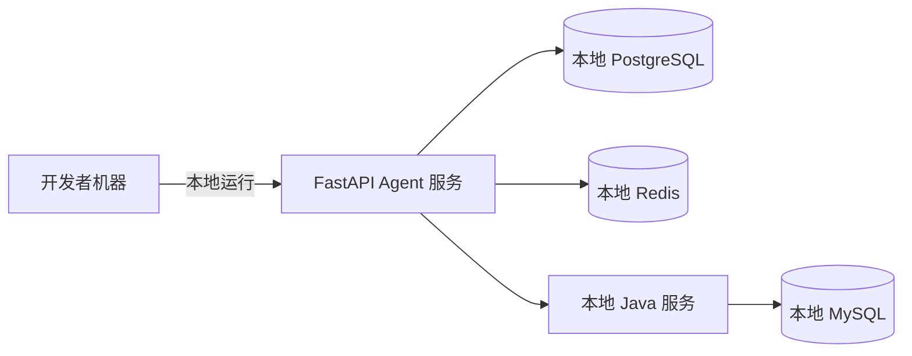
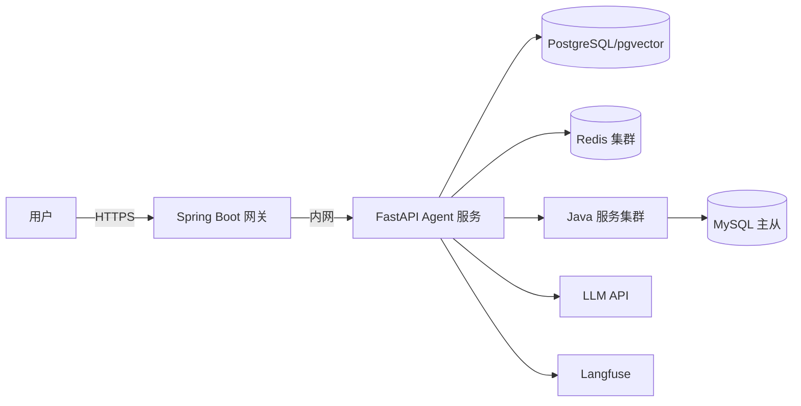
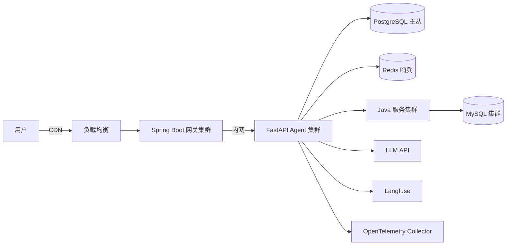

# BMP 三智能体技术架构文档

> 文档版本：v1.1
> 创建日期：2026-07-17
> 更新日期：2026-07-21
> 适用项目：羽擎（Badminton Management Platform，BMP）
> 文档状态：P1 已完成

## 1. 架构概览

### 1.1 总体架构

BMP 三智能体采用"一个 Python Agent 服务 + 三个 LangGraph 子图 + Java 业务事实源"的混合架构。

```mermaid
flowchart LR
    U[Vue / UniApp] -->|JWT + 用户消息| G[Spring Boot Agent 网关]
    G -->|短期签名上下文| A[FastAPI Agent 服务]

    subgraph AG[LangGraph 子图]
        R[路由与会话]
        B[智能预订 Agent]
        I[经营分析 Agent]
        S[场馆客服 Agent]
        R --> B
        R --> I
        R --> S
    end

    A --> AG
    AG -->|受限 Tool 调用| T[/api/agent-tools/**]
    T --> J[现有 Java Service]
    J --> M[(MySQL)]
    A --> P[(PostgreSQL / pgvector)]
    A --> D[(Redis)]
    A --> L[LLM / Embedding / Rerank]
    A --> O[Langfuse / OTel]
```

### 1.2 架构决策理由

- **Python Agent 服务**：完整学习主流 Python Agent 生态（LangGraph、Tool Calling、RAG）
- **单一服务三子图**：公共模型、记忆、监控和 Tool 客户端可复用，运维成本更低
- **Java 事实源**：Spring Boot 继续控制权限、事务、价格、库存、预约冲突和资金等确定性规则
- **后期可拆分**：三个 Agent 保持独立状态、工具白名单、Prompt 和评估集，后期可按负载单独拆分

## 2. 技术栈

### 2.1 Python Agent 服务

| 层级 | 技术 | 版本要求 |
| --- | --- | --- |
| Agent API | Python 3.12.13、FastAPI、Pydantic 2 | Python == 3.12.13 |
| Agent 编排 | LangGraph | 最新稳定版 |
| 模型适配 | OpenAI-compatible Responses API | SDK `responses.create` |
| HTTP 客户端 | HTTPX | 最新稳定版 |
| 会话状态 | LangGraph Checkpoint | 开发环境本地，集成环境 PostgreSQL |
| RAG | PostgreSQL + pgvector | PostgreSQL >= 15 |
| 缓存与限流 | Redis | Redis >= 7.0 |
| 可观测性 | 结构化日志、OpenTelemetry、Langfuse | - |
| Python 质量 | pytest、Ruff、mypy | 最新稳定版 |

### 2.2 Java Agent 网关

| 层级 | 技术 |
| --- | --- |
| Web 框架 | Spring Boot 3.2 |
| 安全认证 | Spring Security + JWT |
| API 文档 | SpringDoc OpenAPI |
| 数据校验 | Jakarta Validation |
| 测试框架 | JUnit 5、Spring Boot Test、MockMvc |

## 3. 目录结构

### 3.1 完整项目结构

```text
BMP/
├── src/main/java/.../modules/agent/       # Java Agent 网关和 Tool 契约层
│   ├── controller/                        # Agent 网关控制器
│   ├── dto/                              # 数据传输对象
│   ├── service/                          # Agent 服务层
│   ├── security/                         # 安全认证和授权
│   └── config/                           # 配置类
├── bmp-agent/                            # Python Agent 服务
│   ├── app/
│   │   ├── api/                          # FastAPI 路由与 DTO
│   │   │   ├── __init__.py
│   │   │   ├── routes.py                 # API 路由定义
│   │   │   └── schemas.py                # Pydantic 模型
│   │   ├── agents/                       # LangGraph 子图
│   │   │   ├── __init__.py
│   │   │   ├── booking/                 # 智能预订子图
│   │   │   │   ├── __init__.py
│   │   │   │   ├── graph.py             # 预订状态图
│   │   │   │   ├── nodes.py             # 预订节点
│   │   │   │   └── prompts.py           # 预订提示词
│   │   │   ├── analytics/               # 经营分析子图
│   │   │   │   ├── __init__.py
│   │   │   │   ├── graph.py             # 分析状态图
│   │   │   │   ├── nodes.py             # 分析节点
│   │   │   │   └── prompts.py           # 分析提示词
│   │   │   └── support/                 # 场馆客服子图
│   │   │       ├── __init__.py
│   │   │       ├── graph.py             # 客服状态图
│   │   │       ├── nodes.py             # 客服节点
│   │   │       └── prompts.py           # 客服提示词
│   │   ├── tools/                       # Java Tool 客户端
│   │   │   ├── __init__.py
│   │   │   ├── client.py                # HTTP 客户端
│   │   │   ├── booking_tools.py         # 预订工具
│   │   │   ├── analytics_tools.py       # 分析工具
│   │   │   └── support_tools.py         # 客服工具
│   │   ├── knowledge/                   # 文档加载、切片、检索
│   │   │   ├── __init__.py
│   │   │   ├── loader.py                # 文档加载器
│   │   │   ├── splitter.py              # 文档切片器
│   │   │   ├── retriever.py             # 检索器
│   │   │   └── embedding.py             # Embedding 服务
│   │   ├── llm/                         # 模型适配与结构化输出
│   │   │   ├── __init__.py
│   │   │   ├── base.py                  # 模型基类
│   │   │   ├── openai_adapter.py        # OpenAI 适配器
│   │   │   └── structured_output.py     # 结构化输出
│   │   ├── memory/                      # Checkpoint 和会话状态
│   │   │   ├── __init__.py
│   │   │   ├── checkpoint.py            # Checkpoint 配置
│   │   │   └── session.py               # 会话管理
│   │   ├── observability/               # 日志、Tracing、指标
│   │   │   ├── __init__.py
│   │   │   ├── logging.py               # 结构化日志
│   │   │   ├── tracing.py               # OpenTelemetry
│   │   │   └── metrics.py               # 指标收集
│   │   └── core/                        # 配置、异常、安全
│   │       ├── __init__.py
│   │       ├── config.py                # 配置管理
│   │       ├── exceptions.py            # 异常定义
│   │       └── security.py              # 安全工具
│   ├── evals/                           # 三只 Agent 的评估数据集
│   │   ├── booking/                     # 预订评估集
│   │   ├── analytics/                   # 分析评估集
│   │   └── support/                     # 客服评估集
│   ├── tests/                           # 单元、契约、集成测试
│   │   ├── unit/                        # 单元测试
│   │   ├── contract/                    # 契约测试
│   │   └── integration/                 # 集成测试
│   ├── pyproject.toml                   # 项目配置
│   ├── requirements.txt                 # 依赖清单
│   └── README.md                        # 项目说明
├── vue/                                 # Web Agent 入口
└── BMP-uniapp/                          # 小程序 Agent 入口
```

### 3.2 模块通信原则

- 模块之间只通过定义明确的 DTO 和接口通信
- 三个 Agent 不直接引用彼此的内部节点或 Prompt
- Python Agent 通过 HTTP 调用 Java Tool API
- Java Tool API 返回稳定的 DTO 和业务错误码

## 4. 数据流与会话管理

### 4.1 用户消息链路

1. **用户请求**：用户通过 Vue 或 UniApp 向 Spring Boot Agent 网关发送消息
2. **身份验证**：Spring Security 验证 JWT，获取用户 ID、角色和所属场馆
3. **上下文生成**：Spring Boot 生成短期签名的 Agent 上下文，通过 `X-Agent-Context-Token` 调用 FastAPI
4. **上下文验证与路由**：FastAPI 从验证后的上下文取得用户身份，并根据显式的 `agentType` 进入对应子图；不信任请求体中的用户身份
5. **Tool 调用**：子图只能调用自身白名单中的 Java Tool
6. **权限验证**：Tool 层再次验证服务身份、用户上下文、角色和资源归属
7. **响应返回**：Agent 返回文本、结构化卡片数据、引用信息或待确认动作
8. **统一转换**：Spring Boot 统一转换为前端响应并写入审计链路

### 4.2 会话与状态管理

#### 会话结构
```python
class Session:
    conversation_id: str      # 会话唯一标识
    user_id: str              # 用户 ID
    agent_type: AgentType     # Agent 类型
    thread_id: str            # LangGraph 线程 ID
    created_at: datetime       # 创建时间
    expires_at: datetime      # 过期时间
```

#### Checkpoint 隔离规则
- Checkpoint 必须按用户和会话隔离
- 禁止仅用可猜测的会话 ID 查询状态
- 对话历史保存期限可配置，生产环境默认 30 天
- 用户可以删除自己的会话
- 管理端不能查看完整私密对话，除非具备审计权限且操作被记录

#### 动作确认机制
- 预订确认动作使用独立的 `actionId`
- 具备状态、过期时间和一次性消费约束
- 状态流转：`PENDING` → `CONFIRMED` 或 `REJECTED`

### 4.3 响应方式

#### 第一阶段（当前实现）
- 使用普通 REST 响应
- 优先保证流程正确和便于测试

#### 第二阶段（后续优化）
- Web 使用 SSE 输出模型片段和工具状态
- UniApp 在兼容性验证后使用 WebSocket
- 无法稳定支持时退化为普通 REST

#### 错误处理原则
- Tool 调用结果和错误不以原始内部格式直接展示给用户
- FastAPI 统一返回 `code`、`message`、`data` 和 `trace_id`，`code` 与 HTTP 状态码语义一致
- 内部链路使用 `X-Agent-Trace-Id` 透传追踪标识
- 不向前端暴露堆栈、Prompt 或供应商原始错误

## 5. 三智能体设计

### 5.1 智能预订 Agent

#### 目标
让用户通过自然语言完成"表达需求、补充信息、比较候选、确认创建预约"的闭环。

#### 状态图


#### 核心能力
- 自然语言参数提取（日期、时间、场馆、模式、偏好）
- 缺失字段澄清（每次只追问一个关键字段）
- 空场查询与替代方案推荐
- 报价生成与展示
- 人工确认机制
- 幂等创建预约

#### 强制规则
- 大模型不得计算或修改最终价格、优惠和余额
- 报价必须包含场馆、场地、日期、起止时间、预约模式、价格和有效期
- 创建预约前必须获得当前会话中的明确确认
- 报价过期、场地状态改变或会话跨用户时必须重新报价
- 创建预约只产生待支付订单；支付仍由现有 BMP 页面完成
- 重复确认、网络重试和双击只能创建一个预约

### 5.2 经营分析 Agent

#### 目标
让会长和场馆管理员用自然语言查询预约、利用率、收入和业务构成，生成可追溯的分析结论。

#### 状态图


#### 核心能力
- 指标识别与白名单校验
- 权限与范围校验
- Java 聚合接口调用
- 数据校验与口径统一
- 分析结论生成
- 受控图表输出

#### 强制规则
- 不提供任意 SQL Tool，不允许 Agent 接收或拼接数据库连接信息
- 所有金额、数量和比例来自 Java 聚合结果，模型只负责解释
- VENUE_MANAGER 的场馆范围由服务端身份决定，忽略客户端伪造
- 每个回答必须包含统计周期、数据范围和所用指标
- 数据量不足时不得生成确定性调价结论
- 图表只返回受控 ECharts 数据结构，不允许模型输出任意前端脚本

### 5.3 场馆客服 Agent

#### 目标
基于经过审核的业务知识回答开放时间、收费规则、预约、器材、课程、退款等常见问题。

#### 状态图


#### 核心能力
- 问题类型识别
- 知识库检索
- 实时数据查询
- 证据评估
- 带引用回答生成
- 拒答与转人工

#### 知识源
- 经运营人员确认的场馆介绍和营业规则
- 收费、会员、预约、取消和退款政策
- 课程、器材租借、赛事和穿线服务 FAQ
- 面向用户的帮助文档

#### 禁止内容
- 数据库结构
- 密钥
- 内部接口说明
- 未脱敏用户信息
- 财务明细
- 内部运维文档

#### 强制规则
- 回答必须返回知识来源标题和更新时间
- 实时价格和营业状态以 Java Tool 为准
- 检索证据不足、内容冲突或涉及资金争议时必须转人工
- Prompt 中出现要求泄露系统提示、密钥或内部资料时必须拒绝
- 知识更新需要重新索引并保留版本，支持回滚

## 6. 可观测性设计

### 6.1 日志规范

#### 结构化日志格式
```json
{
  "timestamp": "2026-07-17T10:30:00Z",
  "level": "INFO",
  "trace_id": "abc123",
  "user_id": "user456",
  "agent_type": "booking",
  "message": "Tool called",
  "tool_name": "query_availability",
  "duration_ms": 150,
  "status": "success"
}
```

#### 日志级别
- **ERROR**：系统错误、安全违规、业务异常
- **WARN**：降级、重试、边界情况
- **INFO**：关键业务操作、Tool 调用
- **DEBUG**：详细调试信息（仅开发环境）

### 6.2 Tracing 设计

#### Trace 链路
```
Vue/UniApp → Spring Boot Agent Gateway → FastAPI Agent Service → LangGraph → Java Tool API → Business Service
```

#### Span 关键节点
1. **request_received**：接收用户请求
2. **auth_validation**：身份验证
3. **agent_routing**：Agent 路由
4. **llm_call**：LLM 调用
5. **tool_call**：Tool 调用
6. **response_sent**：响应发送

### 6.3 指标监控

#### 业务指标
- 对话成功率
- Agent 响应时间
- Tool 调用成功率
- 用户确认率
- 转人工率

#### 技术指标
- Token 消耗量
- LLM 调用延迟
- Tool 调用延迟
- 错误率
- 限流触发次数

#### 成本指标
- 每次对话平均 Token 成本
- 每日总 Token 成本
- 每用户平均成本

## 7. 部署架构

### 7.1 开发环境



### 7.2 集成环境



### 7.3 生产环境



## 8. 性能与扩展性

### 8.1 性能目标

| 指标 | 目标值 |
| --- | --- |
| Agent 响应时间（P50） | < 3s |
| Agent 响应时间（P95） | < 8s |
| Tool 调用延迟 | < 500ms |
| 并发会话数 | > 100 |
| 每日对话数 | > 10,000 |

### 8.2 扩展性设计

#### 水平扩展
- FastAPI Agent 服务无状态设计，支持水平扩展
- Java Tool API 无状态设计，支持水平扩展
- PostgreSQL 使用连接池
- Redis 使用集群模式

#### 垂直扩展
- LLM 调用可配置超时和重试
- 检索可配置 Rerank 和缓存
- 会话历史可配置摘要策略

### 8.3 缓存策略

#### 多级缓存
1. **L1 缓存**：内存缓存（Python 进程内）
2. **L2 缓存**：Redis 缓存（分布式）
3. **L3 缓存**：数据库缓存（PostgreSQL）

#### 缓存失效
- 基于时间的 TTL
- 基于事件的主动失效
- 知识库更新时的批量失效

## 9. 安全架构

### 9.1 身份认证

#### 多层认证
1. **用户认证**：Spring Security + JWT
2. **服务认证**：短期服务凭证
3. **上下文签名**：用户上下文签名验证

### 9.2 权限控制

#### 角色定义
- **USER**：普通用户
- **MEMBER**：会员用户
- **VENUE_MANAGER**：场馆管理员
- **PRESIDENT**：会长

#### 资源权限
- 用户只能操作本人预约和会话
- 场馆管理员只能读取所属场馆数据
- 会长才能跨场馆比较

### 9.3 数据安全

#### 数据最小化
- 模型请求遵循最小化原则
- 不向模型发送敏感数据（密码、JWT、身份证号等）

#### 数据脱敏
- 生产日志设置脱敏规则
- 会话删除同步处理关联数据

#### 数据加密
- 服务间通信使用 HTTPS
- 敏感配置使用环境变量或密钥服务

## 10. 灾备与恢复

### 10.1 备份策略

#### 数据备份
- PostgreSQL 每日全量备份 + 实时归档
- Redis 持久化（RDB + AOF）
- MySQL 定期备份（现有策略）

#### 配置备份
- Prompt 版本管理
- 知识库版本管理
- 评估集版本管理

### 10.2 恢复策略

#### 服务恢复
- Agent 服务故障时自动重启
- Java 服务故障时降级为原页面
- LLM API 故障时返回明确错误

#### 数据恢复
- PostgreSQL 时间点恢复
- Redis 数据恢复
- 知识库索引重建

### 10.3 容灾设计

#### 多可用区
- PostgreSQL 跨可用区主从
- Redis 跨可用区哨兵
- 服务跨可用区部署

#### 故障转移
- 主从自动切换
- 流量自动切换
- 数据自动同步

## 11. 监控告警

### 11.1 监控指标

#### 系统指标
- CPU 使用率
- 内存使用率
- 磁盘使用率
- 网络流量

#### 应用指标
- 请求 QPS
- 响应时间
- 错误率
- 并发连接数

#### 业务指标
- 对话成功率
- 用户满意度
- 转化率
- 成本指标

### 11.2 告警规则

#### P0 告警（立即处理）
- 服务完全不可用
- 数据库连接失败
- 安全漏洞触发

#### P1 告警（1小时内处理）
- 错误率 > 5%
- 响应时间 > 10s
- Token 成本异常

#### P2 告警（24小时内处理）
- 缓存命中率下降
- 磁盘空间不足
- 日志异常

### 11.3 告警通知

#### 通知渠道
- 邮件通知
- 短信通知
- 即时通讯工具
- 电话通知（P0 级别）

#### 通知策略
- 分级通知
- 升级机制
- 抑制策略
- 恢复通知

## 12. 版本管理

### 12.1 语义化版本

#### 版本格式
```
MAJOR.MINOR.PATCH
```

- **MAJOR**：不兼容的 API 变更
- **MINOR**：向后兼容的功能新增
- **PATCH**：向后兼容的问题修复

### 12.2 变更管理

#### Prompt 版本
- 每个 Prompt 独立版本
- 版本关联评估结果
- 支持快速回滚

#### 知识库版本
- 每次重新索引生成新版本
- 保留历史版本
- 支持版本对比

#### 模型版本
- 模型配置版本化
- 支持多模型并行
- 渐进式切换

### 12.3 发布流程

#### 发布检查清单
- [ ] 代码审查通过
- [ ] 测试全部通过
- [ ] 评估指标达标
- [ ] 文档更新完成
- [ ] 备份完成
- [ ] 回滚方案准备

#### 发布策略
- 蓝绿部署
- 金丝雀发布
- 特性开关
- 灰度发布

## 13. 附录

### 13.1 术语表

| 术语 | 定义 |
| --- | --- |
| Agent | 智能体，基于大模型的自主决策系统 |
| LangGraph | 用于构建有状态、多参与者应用的框架 |
| Tool | Agent 可调用的外部工具 |
| Checkpoint | 会话状态持久化机制 |
| RAG | 检索增强生成 |
| Idempotency-Key | 幂等键，用于防止重复操作 |
| TraceId | 追踪 ID，用于关联整个请求链路 |

### 13.2 参考文档

- [LangGraph 官方文档](https://langchain-ai.github.io/langgraph/)
- [FastAPI 官方文档](https://fastapi.tiangolo.com/)
- [Spring Boot 官方文档](https://spring.io/projects/spring-boot)
- [OpenTelemetry 官方文档](https://opentelemetry.io/)

### 13.3 联系方式

- 技术负责人：[待填写]
- 运维负责人：[待填写]
- 产品负责人：[待填写]
